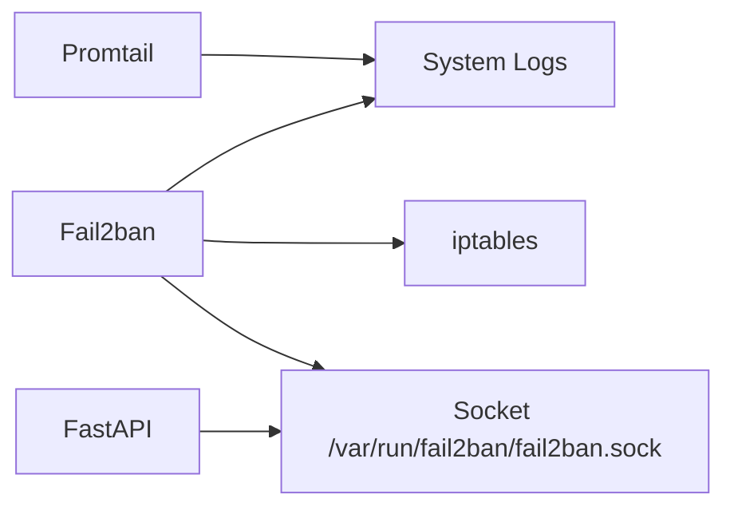
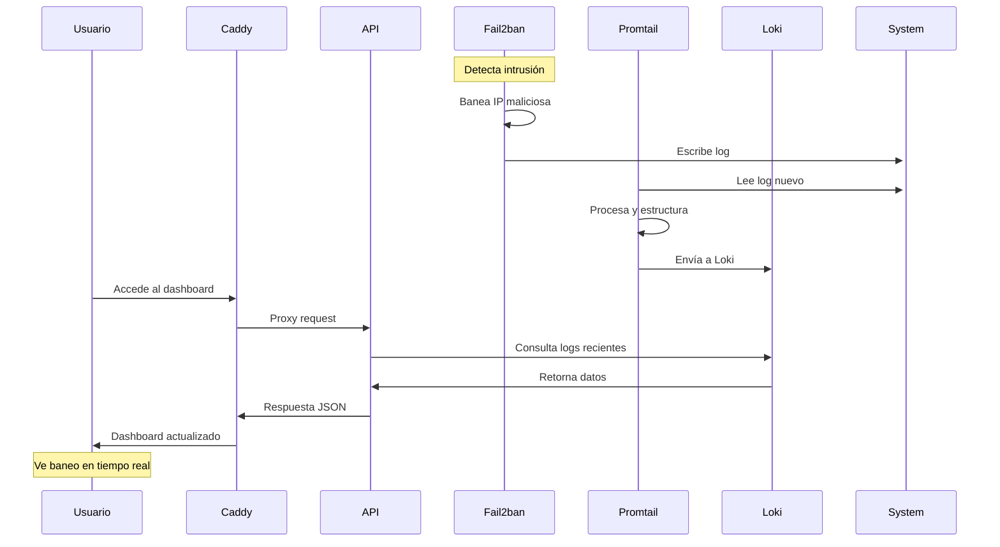

# 📋 Componentes del Sistema

## Introducción

Esta sección detalla cada componente del sistema Fail2ban Dashboard, explicando su función específica, configuración y cómo interactúa con otros servicios.

## 🛡️ Fail2ban (Host Service)

### Descripción

**Fail2ban** es el corazón del sistema de seguridad. Monitorea logs del sistema en tiempo real y aplica baneos automáticos a IPs que muestran comportamiento sospechoso.

### Características Principales

!!! success "Funcionalidades"
    - **Monitoreo en tiempo real** de logs del sistema
    - **Baneos automáticos** basados en patrones configurables
    - **Múltiples jails** para diferentes servicios (SSH, HTTP, etc.)
    - **Integración con iptables** para aplicar reglas de firewall
    - **API cliente** para gestión programática

### Configuración

=== "Archivos Clave"
    - `/etc/fail2ban/jail.conf` - Configuración base (NO modificar)
    - `/etc/fail2ban/jail.local` - Configuración personalizada
    - `/etc/fail2ban/jail.d/` - Configuraciones específicas por servicio
    - `/var/log/fail2ban.log` - Logs de actividad

=== "Variables Importantes"
    ```ini
    [DEFAULT]
    bantime = 3600        # Tiempo de baneo (segundos)
    findtime = 600        # Ventana de observación
    maxretry = 5          # Intentos máximos permitidos
    ignoreip = 127.0.0.1/8 ::1  # IPs nunca baneadas
    ```

### Interacciones



---

## 📜 Promtail (Container)

### Descripción

**Promtail** es el agente recolector de logs que lee continuamente los archivos de log del sistema y los envía a Loki para almacenamiento y procesamiento.

### Características Principales

!!! info "Funcionalidades"
    - **Lectura continua** de archivos de log
    - **Parsing y estructuración** de logs con regex
    - **Etiquetado automático** para facilitar consultas
    - **Multiline support** para logs complejos
    - **Buffer management** para garantizar entrega

### Pipeline de Procesamiento

```yaml
# promtail/promtail.yaml
pipeline_stages:
  # 1. Multiline: Agrupa logs relacionados
  - multiline:
      firstline: '^\d{4}-\d{2}-\d{2} \d{2}:\d{2}:\d{2}'
  
  # 2. Regex: Extrae campos estructurados
  - regex:
      expression: '^(?P<time>\d{4}-\d{2}-\d{2} \d{2}:\d{2}:\d{2},\d{3}) (?P<component>[\w.]+)\[(?P<pid>\d+)\]: (?P<level>\w+)\s+(\[(?P<jail>\w+)\] )?(?P<msg>.*)'
  
  # 3. Timestamp: Parsea fecha y hora
  - timestamp:
      source: time
      format: '2006-01-02 15:04:05,000'
  
  # 4. Labels: Crea etiquetas para Loki
  - labels:
      component:
      level:
      jail:
  
  # 5. Output: Formateo final
  - output:
      source: msg
```

### Volúmenes y Montajes

```yaml
# docker-compose.yaml
volumes:
  - /var/log/fail2ban.log:/var/log/fail2ban.log:ro
  - /tmp/positions.yaml:/tmp/positions.yaml
```

!!! warning "Permisos"
    Promtail necesita **acceso de lectura** a los logs de Fail2ban. Asegúrate de que el usuario Docker tenga permisos adecuados.

---

## 🗄️ Loki (Container)

### Descripción

**Loki** es el sistema de agregación y almacenamiento de logs, optimizado para consultas rápidas y almacenamiento eficiente.

### Características Principales

!!! success "Funcionalidades"
    - **Almacenamiento distribuido** de logs
    - **Indexación por etiquetas** para consultas eficientes
    - **Compresión automática** para optimizar espacio
    - **Retención configurable** de datos
    - **API REST** para consultas y streaming

### Configuración de Almacenamiento

```yaml
# loki/config.yaml
storage_config:
  boltdb_shipper:
    active_index_directory: /loki/boltdb-shipper-active
    cache_location: /loki/boltdb-shipper-cache
    shared_store: filesystem
  filesystem:
    directory: /loki/chunks

schema_config:
  configs:
    - from: 2020-10-24
      store: boltdb-shipper
      object_store: filesystem
      schema: v11
      index:
        prefix: index_
        period: 24h
```

### Endpoints de API

| Endpoint | Método | Descripción |
|----------|---------|-------------|
| `/loki/api/v1/push` | POST | Ingesta de logs desde Promtail |
| `/loki/api/v1/query` | GET | Consultas instantáneas |
| `/loki/api/v1/query_range` | GET | Consultas con rango de tiempo |
| `/loki/api/v1/tail` | GET/WS | Streaming de logs en tiempo real |
| `/loki/api/v1/labels` | GET | Lista de etiquetas disponibles |

### Persistencia de Datos

```yaml
# Volumen Docker para persistencia
volumes:
  loki_data:
    driver: local
```

!!! tip "Backup"
    Los datos de Loki se almacenan en el volumen `loki_data`. Realizar backups regulares de este volumen.

---

## ⚙️ API FastAPI (Container)

### Descripción

**FastAPI** es el backend principal que proporciona la interfaz REST para interactuar con todos los servicios del sistema.

### Características Principales

!!! success "Funcionalidades"
    - **API REST** completa con documentación automática
    - **WebSockets** para streaming en tiempo real
    - **Integración con Fail2ban** via socket Unix
    - **Consultas a Loki** para datos históricos
    - **Servicio de archivos estáticos** y templates HTML

### Estructura del Proyecto

```
api/
├── main.py                 # Aplicación principal FastAPI
├── controllers/            # Endpoints REST
│   ├── logs_controller.py
│   ├── jails_controller.py
│   └── stats_controller.py
├── services/              # Lógica de negocio
│   ├── loki_service.py
│   ├── fail2ban_service.py
│   └── websocket_service.py
├── data/                  # Modelos de datos
│   ├── log_models.py
│   └── jail_models.py
├── configuration/         # Configuración
│   └── settings.py
├── static/               # Archivos CSS/JS
├── templates/            # Templates HTML
└── requirements.txt      # Dependencias Python
```

### Endpoints Principales

=== "Logs"
    ```python
    # GET /api/logs
    # Consulta logs con filtros
    @router.get("/logs")
    async def get_logs(
        start_time: str,
        end_time: str,
        jail: Optional[str] = None,
        level: Optional[str] = None
    ):
        # Consulta a Loki via HTTP
        return loki_service.query_logs(...)
    ```

=== "Jails"
    ```python
    # GET /api/jails
    # Lista jails activos
    @router.get("/jails")
    async def get_jails():
        # Consulta via fail2ban-client
        return fail2ban_service.get_jails()
    
    # POST /api/jails/{jail}/ban
    # Banea IP en jail específico
    @router.post("/jails/{jail}/ban")
    async def ban_ip(jail: str, ip: str):
        return fail2ban_service.ban_ip(jail, ip)
    ```

=== "WebSockets"
    ```python
    # WebSocket /ws/logs
    # Streaming de logs en tiempo real
    @router.websocket("/ws/logs")
    async def websocket_logs(websocket: WebSocket):
        # Proxy a Loki /tail endpoint
        await websocket_service.stream_logs(websocket)
    ```

### Configuración de Variables

```python
# configuration/settings.py
from pydantic_settings import BaseSettings

class Settings(BaseSettings):
    loki_query_url: str = "http://loki:3100/loki/api/v1/query_range"
    loki_ws_url: str = "ws://loki:3100/loki/api/v1/tail"
    fail2ban_log_path: str = "/var/log/fail2ban.log"
    api_port: int = 8000
    
    class Config:
        env_file = ".env"

settings = Settings()
```

### Dependencias Docker

```dockerfile
# Dockerfile
FROM python:3.10-slim

# Instalar fail2ban-client
RUN apt-get update && apt-get install -y fail2ban && rm -rf /var/lib/apt/lists/*

# Instalar dependencias Python
COPY requirements.txt .
RUN pip install --no-cache-dir -r requirements.txt

# Copiar código
COPY . /app
WORKDIR /app

# Configurar Uvicorn para proxy headers
CMD ["uvicorn", "main:app", "--host", "0.0.0.0", "--port", "8000", "--proxy-headers", "--forwarded-allow-ips", "*"]
```

---

## 🔒 Caddy (Host Service)

### Descripción

**Caddy** es el servidor web y proxy inverso que maneja el tráfico HTTPS, certificados SSL automáticos y ruteo de requests.

### Características Principales

!!! success "Funcionalidades"
    - **HTTPS automático** con Let's Encrypt
    - **Proxy inverso** hacia la API FastAPI
    - **Renovación automática** de certificados
    - **Redirección HTTP → HTTPS** automática
    - **Headers de seguridad** configurables

### Configuración Caddyfile

```caddyfile
# /etc/caddy/Caddyfile
alertasfail2ban.xmakuno.com {
    # Proxy inverso a la API
    reverse_proxy localhost:8000
    
    # Headers de seguridad
    header {
        # HSTS
        Strict-Transport-Security max-age=31536000
        # Prevenir clickjacking
        X-Frame-Options DENY
        # Prevenir MIME sniffing
        X-Content-Type-Options nosniff
        # XSS Protection
        X-XSS-Protection "1; mode=block"
    }
    
    # Logs de acceso
    log {
        output file /var/log/caddy/access.log
        format json
    }
    
    # Manejo de errores personalizado
    handle_errors {
        @5xx expression {http.error.status_code} >= 500
        respond @5xx "Error interno del servidor" 500
    }
}

# Redirección de www (opcional)
www.alertasfail2ban.xmakuno.com {
    redir https://alertasfail2ban.xmakuno.com{uri} permanent
}
```

### Gestión de Certificados

!!! info "Let's Encrypt Automático"
    Caddy maneja automáticamente:
    
    - **Obtención inicial** de certificados SSL
    - **Validación HTTP-01** para verificar dominio
    - **Renovación automática** antes del vencimiento
    - **Fallback a HTTP** si hay problemas con HTTPS

### Logs y Monitoreo

```bash
# Logs de Caddy
sudo journalctl -u caddy -f

# Estado del servicio
sudo systemctl status caddy

# Verificar certificados
caddy list-certificates
```

---

## 🐳 Docker y Orquestación

### Docker Compose Configuration

```yaml
# docker-compose.yaml
version: '3.8'

services:
  api:
    build: 
      context: ./api
      dockerfile: Dockerfile
    container_name: fail2ban-api
    restart: unless-stopped
    ports:
      - "8000:8000"
    volumes:
      - /var/run/fail2ban/fail2ban.sock:/var/run/fail2ban/fail2ban.sock
      - /var/log/fail2ban.log:/var/log/fail2ban.log:ro
    environment:
      - LOKI_QUERY_URL=http://loki:3100/loki/api/v1/query_range
      - LOKI_WS_URL=ws://loki:3100/loki/api/v1/tail
    depends_on:
      - loki
    networks:
      - fail2ban_network

  loki:
    image: grafana/loki:latest
    container_name: fail2ban-loki
    restart: unless-stopped
    ports:
      - "3100:3100"
    volumes:
      - ./loki/config.yaml:/etc/loki/local-config.yaml
      - loki_data:/loki
    command: -config.file=/etc/loki/local-config.yaml
    networks:
      - fail2ban_network

  promtail:
    image: grafana/promtail:latest
    container_name: fail2ban-promtail
    restart: unless-stopped
    volumes:
      - ./promtail/promtail.yaml:/etc/promtail/config.yml
      - /var/log/fail2ban.log:/var/log/fail2ban.log:ro
      - /tmp/positions.yaml:/tmp/positions.yaml
    command: -config.file=/etc/promtail/config.yml
    depends_on:
      - loki
    networks:
      - fail2ban_network

volumes:
  loki_data:
    driver: local

networks:
  fail2ban_network:
    driver: bridge
```

### Políticas de Restart

!!! tip "Alta Disponibilidad"
    Todos los servicios están configurados con `restart: unless-stopped` para:
    
    - **Reinicio automático** si el contenedor falla
    - **Supervivencia a reinicios** del sistema
    - **Recuperación automática** tras actualizaciones de Docker

## Flujo de Datos Completo



!!! success "Próximo Paso"
    Explora los [diagramas detallados](diagrams.md) para ver representaciones visuales completas de la arquitectura.