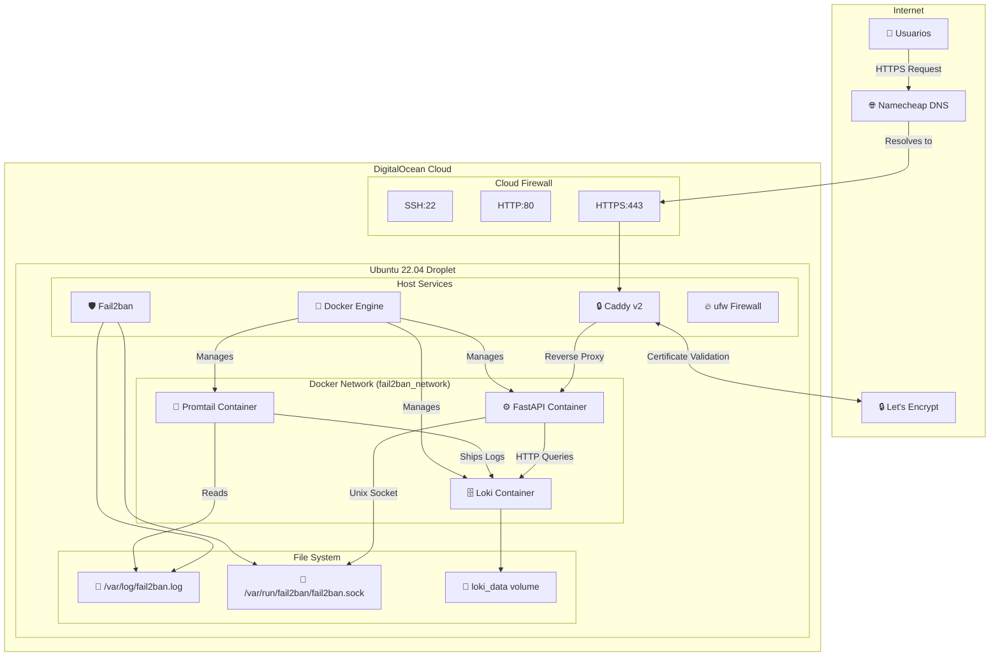
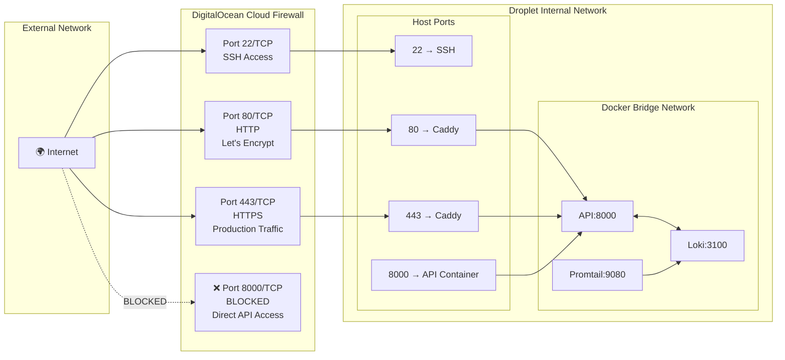
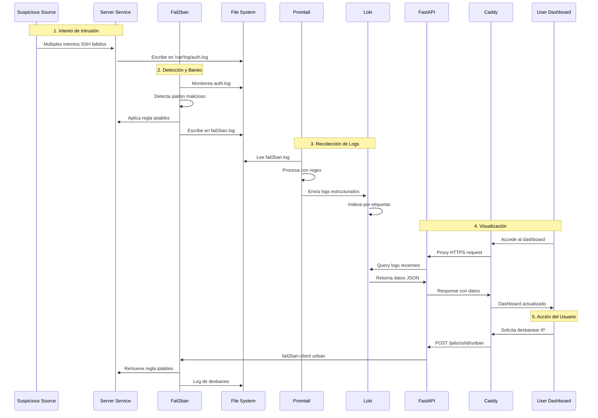
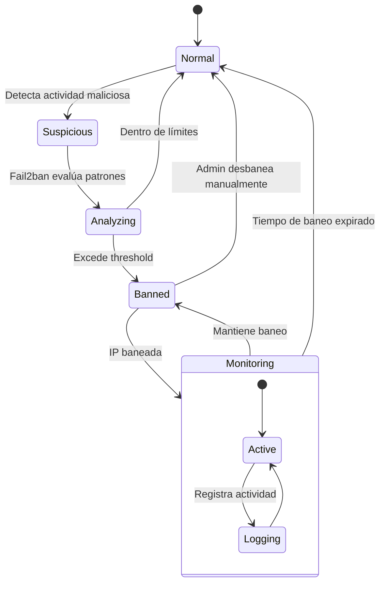
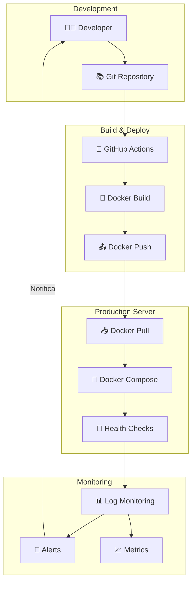
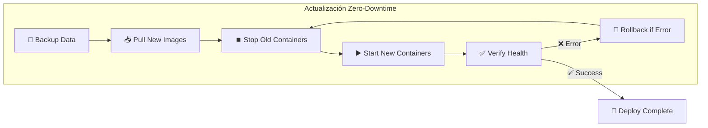
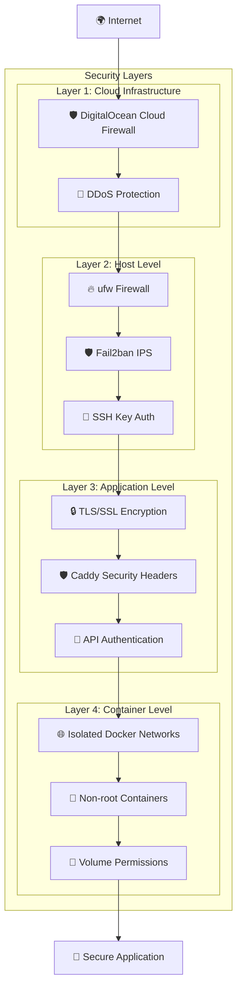
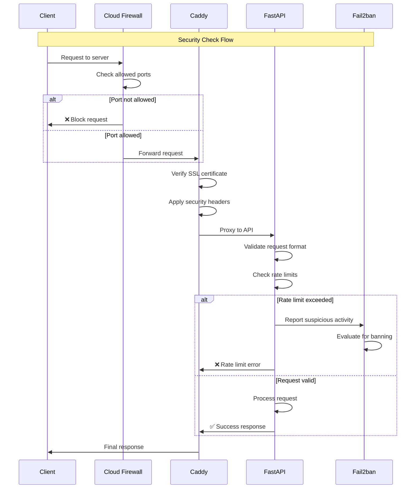

# 🗺️ Diagramas de Arquitectura

## Introducción

Esta sección presenta diagramas técnicos detallados que muestran la arquitectura del sistema desde diferentes perspectivas: infraestructura, flujo de datos, redes y despliegue.

## 🏗️ Arquitectura de Infraestructura

### Vista General del Sistema



## 🌐 Arquitectura de Red

### Configuración de Puertos y Firewall



### Flujo de Red Detallado

!!! info "Configuración de Seguridad de Red"
    === "Puertos Expuestos"
        - **22/TCP**: SSH para administración (restringir por IP)
        - **80/TCP**: HTTP para validación Let's Encrypt
        - **443/TCP**: HTTPS para tráfico de producción
    
    === "Puertos Internos"
        - **8000/TCP**: API FastAPI (solo localhost)
        - **3100/TCP**: Loki (solo red Docker)
        - **9080/TCP**: Promtail (solo red Docker)
    
    === "Bloqueos Críticos"
        - ❌ Puerto 8000 **NO** debe estar abierto en Cloud Firewall
        - ❌ Puertos 3100, 9080 **NO** deben ser accesibles externamente

## 📊 Flujo de Datos y Procesamiento

### Pipeline Completo de Logs



### Estados del Sistema



## 🔄 Arquitectura de Despliegue

### Flujo de CI/CD y Despliegue



### Estrategia de Actualización



## 🔐 Arquitectura de Seguridad

### Capas de Seguridad



### Flujo de Autenticación y Autorización



## 📈 Arquitectura de Monitoreo

### Sistema de Observabilidad

```mermaid
graph TB
    subgraph "Data Sources"
        APP_LOGS[📝 Application Logs]
        SYS_LOGS[📋 System Logs]
        FAIL2BAN_LOGS[🛡️ Fail2ban Logs]
        CADDY_LOGS[🔒 Caddy Logs]
    end
    
    subgraph "Collection Layer"
        PROMTAIL[📜 Promtail Agent]
        FILEBEAT[📊 Log Shippers]
    end
    
    subgraph "Storage & Processing"
        LOKI[🗄️ Loki Log Store]
        ELASTIC[🔍 Search Engine]
    end
    
    subgraph "Visualization"
        API_ENDPOINT[⚙️ API Endpoints]
        DASHBOARD[📊 Web Dashboard]
        GRAFANA[📈 Grafana (Optional)]
    end
    
    subgraph "Alerting"
        WEBHOOKS[🔗 Webhooks]
        EMAIL[📧 Email Alerts]
        SLACK[💬 Slack Integration]
    end
    
    APP_LOGS --> PROMTAIL
    SYS_LOGS --> PROMTAIL
    FAIL2BAN_LOGS --> PROMTAIL
    CADDY_LOGS --> FILEBEAT
    
    PROMTAIL --> LOKI
    FILEBEAT --> ELASTIC
    
    LOKI --> API_ENDPOINT
    ELASTIC --> API_ENDPOINT
    
    API_ENDPOINT --> DASHBOARD
    API_ENDPOINT --> GRAFANA
    
    API_ENDPOINT --> WEBHOOKS
    WEBHOOKS --> EMAIL
    WEBHOOKS --> SLACK
```

## 🚀 Escalabilidad y Alta Disponibilidad

### Arquitectura Escalable

```mermaid
graph TB
    subgraph "Load Balancer Tier"
        LB[⚖️ Load Balancer]
        CDN[🌐 CDN (Optional)]
    end
    
    subgraph "Application Tier"
        API1[⚙️ API Instance 1]
        API2[⚙️ API Instance 2]
        API3[⚙️ API Instance N]
    end
    
    subgraph "Data Tier"
        LOKI_CLUSTER[🗄️ Loki Cluster]
        DB_BACKUP[💾 Database Backup]
    end
    
    subgraph "Monitoring Tier"
        PROMTAIL_MULTI[📜 Promtail Instances]
        METRICS[📊 Metrics Collection]
    end
    
    CDN --> LB
    LB --> API1
    LB --> API2
    LB --> API3
    
    API1 --> LOKI_CLUSTER
    API2 --> LOKI_CLUSTER
    API3 --> LOKI_CLUSTER
    
    LOKI_CLUSTER --> DB_BACKUP
    
    PROMTAIL_MULTI --> LOKI_CLUSTER
    METRICS --> LOKI_CLUSTER
```

!!! tip "Consideraciones de Escalabilidad"
    === "Escala Horizontal"
        - **Múltiples instancias API** detrás de load balancer
        - **Cluster de Loki** para mayor capacidad de almacenamiento
        - **Múltiples Promtail** para recolección distribuida
    
    === "Escala Vertical"
        - **Incrementar recursos** de los contenedores existentes
        - **Optimizar consultas** a Loki para mejor rendimiento
        - **Tuning de configuraciones** para mayor throughput
    
    === "Alta Disponibilidad"
        - **Health checks** automáticos en todos los servicios
        - **Failover automático** con restart policies
        - **Backups regulares** de datos críticos
        - **Monitoreo proactivo** con alertas

!!! success "Próximo Paso"
    Ahora que entiendes la arquitectura completa, continúa con la [configuración del servidor](../servidor/droplet-setup.md) para implementar este sistema paso a paso.