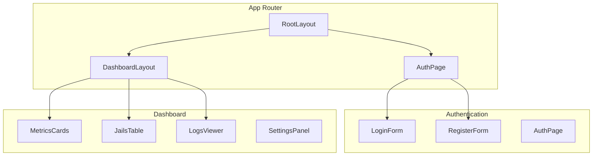

# 🧩 Componentes del Frontend

## Arquitectura de Componentes

### Jerarquía Principal



## 🔐 Componentes de Autenticación

### AuthPage.tsx

```tsx
'use client'

import { useState } from 'react'
import { AnimatePresence, motion } from 'framer-motion'

export function AuthPage() {
  const [mode, setMode] = useState<'login' | 'register'>('login')

  return (
    <section className="min-h-screen flex flex-col lg:flex-row">
      <section className="flex-1 flex items-center justify-center p-8">
        <AnimatePresence mode="wait">
          {mode === 'login' ? (
            <motion.div
              key="login"
              initial={{ opacity: 0, x: 100 }}
              animate={{ opacity: 1, x: 0 }}
              exit={{ opacity: 0, x: -100 }}
            >
              <LoginForm onSwitchToRegister={() => setMode('register')} />
            </motion.div>
          ) : (
            <motion.div
              key="register"
              initial={{ opacity: 0, x: 100 }}
              animate={{ opacity: 1, x: 0 }}
              exit={{ opacity: 0, x: -100 }}
            >
              <RegisterForm onSwitchToLogin={() => setMode('login')} />
            </motion.div>
          )}
        </AnimatePresence>
      </section>
      
      {/* Hero section */}
      <HeroSection />
    </section>
  )
}
```

### LoginForm.tsx

```tsx
'use client'

import { useForm } from 'react-hook-form'
import { zodResolver } from '@hookform/resolvers/zod'
import { useState } from 'react'
import { Eye, EyeOff } from 'lucide-react'

export function LoginForm({ onSwitchToRegister }: LoginFormProps) {
  const [showPassword, setShowPassword] = useState(false)

  const form = useForm<LoginFormData>({
    resolver: zodResolver(loginSchema),
    defaultValues: {
      emailOrUsername: '',
      password: '',
      rememberMe: false
    }
  })

  const handleSubmit = async (data: LoginFormData) => {
    // Autenticación con server action
    const result = await signin(data)
    if (result.error) {
      form.setError('root', { message: result.error })
    }
  }

  return (
    <Form {...form}>
      <form onSubmit={form.handleSubmit(handleSubmit)} className="space-y-5">
        <FormField
          control={form.control}
          name="emailOrUsername"
          render={({ field }) => (
            <FormItem>
              <FormLabel>Email or Username</FormLabel>
              <FormControl>
                <Input {...field} placeholder="Enter email or username" />
              </FormControl>
              <FormMessage />
            </FormItem>
          )}
        />
        
        <FormField
          control={form.control}
          name="password"
          render={({ field }) => (
            <FormItem>
              <FormLabel>Password</FormLabel>
              <FormControl>
                <div className="relative">
                  <Input
                    {...field}
                    type={showPassword ? 'text' : 'password'}
                    placeholder="Enter password"
                  />
                  <Button
                    type="button"
                    variant="ghost"
                    size="sm"
                    className="absolute right-0 top-0"
                    onClick={() => setShowPassword(!showPassword)}
                  >
                    {showPassword ? <EyeOff /> : <Eye />}
                  </Button>
                </div>
              </FormControl>
              <FormMessage />
            </FormItem>
          )}
        />

        <Button type="submit" className="w-full">
          Sign In
        </Button>
      </form>
    </Form>
  )
}
```

## 📊 Componentes del Dashboard

### MetricsCard.tsx

```tsx
interface MetricsCardProps {
  title: string
  value: string | number
  change?: number
  icon: React.ReactNode
  trend?: 'up' | 'down' | 'neutral'
}

export function MetricsCard({ 
  title, 
  value, 
  change, 
  icon, 
  trend 
}: MetricsCardProps) {
  return (
    <Card className="p-6">
      <div className="flex items-center justify-between">
        <div>
          <p className="text-sm font-medium text-muted-foreground">
            {title}
          </p>
          <p className="text-2xl font-bold">
            {typeof value === 'number' ? value.toLocaleString() : value}
          </p>
        </div>
        <div className="h-8 w-8 text-muted-foreground">
          {icon}
        </div>
      </div>
      
      {change && (
        <div className="mt-4 flex items-center text-sm">
          <TrendingUp 
            className={cn(
              "mr-1 h-3 w-3",
              trend === 'up' && "text-green-600",
              trend === 'down' && "text-red-600"
            )} 
          />
          <span className={cn(
            trend === 'up' && "text-green-600",
            trend === 'down' && "text-red-600"
          )}>
            {change > 0 ? '+' : ''}{change}%
          </span>
          <span className="text-muted-foreground ml-1">
            from last month
          </span>
        </div>
      )}
    </Card>
  )
}
```

### JailsTable.tsx

```tsx
'use client'

import { useState, useEffect } from 'react'
import { Badge } from '@/components/ui/badge'
import { Button } from '@/components/ui/button'

interface Jail {
  name: string
  status: 'active' | 'inactive'
  banned_ips: string[]
  total_failed: number
  total_banned: number
}

export function JailsTable() {
  const [jails, setJails] = useState<Jail[]>([])
  const [loading, setLoading] = useState(true)

  useEffect(() => {
    fetchJails()
  }, [])

  const fetchJails = async () => {
    try {
      const response = await fetch('/api/jails')
      const data = await response.json()
      setJails(data)
    } catch (error) {
      console.error('Error fetching jails:', error)
    } finally {
      setLoading(false)
    }
  }

  if (loading) {
    return <div className="animate-pulse">Loading jails...</div>
  }

  return (
    <Card>
      <CardHeader>
        <CardTitle>Fail2ban Jails</CardTitle>
      </CardHeader>
      <CardContent>
        <Table>
          <TableHeader>
            <TableRow>
              <TableHead>Jail Name</TableHead>
              <TableHead>Status</TableHead>
              <TableHead>Banned IPs</TableHead>
              <TableHead>Failed Attempts</TableHead>
              <TableHead>Actions</TableHead>
            </TableRow>
          </TableHeader>
          <TableBody>
            {jails.map((jail) => (
              <TableRow key={jail.name}>
                <TableCell className="font-medium">{jail.name}</TableCell>
                <TableCell>
                  <Badge 
                    variant={jail.status === 'active' ? 'default' : 'secondary'}
                  >
                    {jail.status}
                  </Badge>
                </TableCell>
                <TableCell>
                  <Badge variant="outline">
                    {jail.banned_ips.length}
                  </Badge>
                </TableCell>
                <TableCell>{jail.total_failed}</TableCell>
                <TableCell>
                  <Button variant="outline" size="sm">
                    View Details
                  </Button>
                </TableCell>
              </TableRow>
            ))}
          </TableBody>
        </Table>
      </CardContent>
    </Card>
  )
}
```

### LogsViewer.tsx

```tsx
'use client'

import { useEffect, useState } from 'react'
import { ScrollArea } from '@/components/ui/scroll-area'

interface LogEntry {
  timestamp: string
  level: 'INFO' | 'WARNING' | 'ERROR'
  message: string
  jail?: string
  ip?: string
}

export function LogsViewer() {
  const [logs, setLogs] = useState<LogEntry[]>([])
  const [connected, setConnected] = useState(false)

  useEffect(() => {
    // WebSocket connection for real-time logs
    const ws = new WebSocket(process.env.NEXT_PUBLIC_WS_URL + '/logs')
    
    ws.onopen = () => setConnected(true)
    ws.onclose = () => setConnected(false)
    
    ws.onmessage = (event) => {
      const logEntry = JSON.parse(event.data)
      setLogs(prev => [logEntry, ...prev.slice(0, 99)]) // Keep last 100 logs
    }

    return () => ws.close()
  }, [])

  return (
    <Card className="h-[600px]">
      <CardHeader>
        <div className="flex items-center justify-between">
          <CardTitle>Real-time Logs</CardTitle>
          <Badge variant={connected ? 'default' : 'destructive'}>
            {connected ? 'Connected' : 'Disconnected'}
          </Badge>
        </div>
      </CardHeader>
      <CardContent>
        <ScrollArea className="h-[500px]">
          <div className="space-y-2">
            {logs.map((log, index) => (
              <div 
                key={index}
                className="flex items-start gap-3 p-3 rounded-lg bg-muted/50"
              >
                <Badge 
                  variant={
                    log.level === 'ERROR' ? 'destructive' :
                    log.level === 'WARNING' ? 'secondary' : 'default'
                  }
                  className="mt-1"
                >
                  {log.level}
                </Badge>
                <div className="flex-1 min-w-0">
                  <p className="text-sm text-muted-foreground">
                    {new Date(log.timestamp).toLocaleString()}
                  </p>
                  <p className="text-sm break-words">{log.message}</p>
                  {log.jail && (
                    <Badge variant="outline" className="mt-1">
                      {log.jail}
                    </Badge>
                  )}
                </div>
              </div>
            ))}
          </div>
        </ScrollArea>
      </CardContent>
    </Card>
  )
}
```

## 🎨 Componentes UI Base

### Custom Input Component

```tsx
// components/ui/input.tsx
import { forwardRef } from 'react'
import { cn } from '@/lib/utils'

export interface InputProps extends React.InputHTMLAttributes<HTMLInputElement> {}

const Input = forwardRef<HTMLInputElement, InputProps>(
  ({ className, type, ...props }, ref) => {
    return (
      <input
        type={type}
        className={cn(
          "flex h-10 w-full rounded-md border border-input bg-background px-3 py-2",
          "text-sm ring-offset-background file:border-0 file:bg-transparent",
          "file:text-sm file:font-medium placeholder:text-muted-foreground",
          "focus-visible:outline-none focus-visible:ring-2 focus-visible:ring-ring",
          "focus-visible:ring-offset-2 disabled:cursor-not-allowed disabled:opacity-50",
          className
        )}
        ref={ref}
        {...props}
      />
    )
  }
)

Input.displayName = "Input"
export { Input }
```

!!! tip "Mejores Prácticas"
    - Usa TypeScript para todas las props
    - Implementa proper error boundaries
    - Usa forwardRef para componentes que necesitan refs
    - Mantén componentes pequeños y enfocados

!!! warning "Performance"
    - Usa React.memo para componentes pesados
    - Implementa virtualization para listas largas
    - Usa Suspense para lazy loading

!!! success "Reutilización"
    - Crea un design system consistente
    - Usa shadcn/ui como base
    - Implementa variants con class-variance-authority