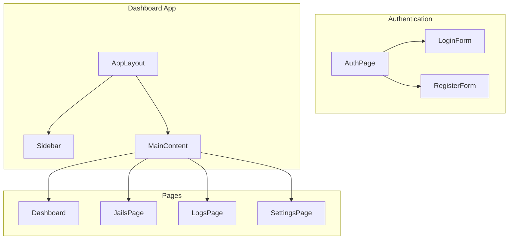

# 🎨 Características del Frontend

## Dashboard Principal

### Características Principales

!!! success "Funcionalidades"
    - **🔐 Autenticación Segura**: Login y registro con validación avanzada
    - **📊 Dashboard en Tiempo Real**: Métricas y gráficos actualizados automáticamente
    - **🛡️ Monitoreo Fail2ban**: Vista completa de jails, IPs baneadas y logs
    - **📱 Responsive Design**: Optimizado para desktop, tablet y móvil
    - **🌙 Modo Oscuro**: Tema dark nativo con soporte completo
    - **⚡ Performance**: SSR con Next.js para carga rápida

### Componentes Principales



## 🔧 Tecnologías Utilizadas

### Stack Tecnológico

| Componente | Tecnología | Propósito |
|------------|------------|-----------|
| **Framework** | Next.js 15 | React con SSR/SSG |
| **UI Library** | Tailwind CSS + shadcn/ui | Componentes modernos |
| **Forms** | React Hook Form + Zod | Validación y manejo de formularios |
| **Animation** | Framer Motion | Transiciones suaves |
| **State** | React Query + Zustand | Gestión de estado |
| **Auth** | NextAuth.js | Autenticación segura |
| **TypeScript** | TypeScript 5 | Tipado estático |

### Estructura del Proyecto

```
src/
├── app/                    # App Router de Next.js
│   ├── (auth)/            # Rutas de autenticación
│   ├── (dashboard)/       # Rutas del dashboard
│   ├── api/               # API Routes
│   └── globals.css        # Estilos globales
├── components/            # Componentes reutilizables
│   ├── ui/                # Componentes base (shadcn/ui)
│   ├── forms/             # Formularios específicos
│   └── layout/            # Componentes de layout
├── lib/                   # Utilidades y configuración
├── types/                 # Definiciones de tipos
└── hooks/                 # Custom hooks
```

## 🔐 Sistema de Autenticación

### LoginForm Component

- **Validación robusta** con Zod schemas
- **Soporte dual** para email o username
- **Persistencia de sesión** con "Remember me"
- **Estados de loading** y error handling
- **Transiciones animadas** entre formularios

### RegisterForm Component

- **Validación en tiempo real** de campos
- **Confirmación de contraseña** con matching
- **Términos y condiciones** obligatorios
- **Feedback visual** de errores
- **Integración con backend** para registro

## 📊 Funcionalidades del Dashboard

### Páginas Principales

=== "Dashboard Overview"
    - **Métricas en tiempo real** de seguridad
    - **Gráficos interactivos** de tendencias
    - **Alertas visuales** de eventos críticos
    - **Estado general** del sistema

=== "Jails Management"
    - **Lista completa** de jails configurados
    - **Estado en tiempo real** de cada jail
    - **IPs baneadas** con detalles geográficos
    - **Acciones rápidas** de ban/unban

=== "Logs Viewer"
    - **Stream en tiempo real** de logs
    - **Filtros avanzados** por jail, IP, fecha
    - **Búsqueda instantánea** con highlighting
    - **Export de datos** en múltiples formatos

=== "Settings Panel"
    - **Configuración de usuario** y preferencias
    - **Gestión de notificaciones** y alertas
    - **Configuración de dashboard** personalizable

## 🎨 Diseño y UX

### Características de Diseño

- **Design System** consistente con shadcn/ui
- **Modo oscuro nativo** con persistencia
- **Animaciones suaves** con Framer Motion
- **Layout responsivo** con Tailwind CSS
- **Accesibilidad** completa (a11y)

### Componentes UI Clave

```tsx
// Ejemplo de componente de métricas
const MetricsCard = ({ title, value, trend, icon }) => (
  <Card className="p-6">
    <div className="flex items-center justify-between">
      <div>
        <p className="text-sm font-medium text-muted-foreground">{title}</p>
        <p className="text-2xl font-bold">{value}</p>
      </div>
      <div className="h-8 w-8 text-muted-foreground">
        {icon}
      </div>
    </div>
    {trend && (
      <div className="mt-4 flex items-center text-sm">
        <TrendingUp className="mr-1 h-3 w-3" />
        <span className="text-green-600">+{trend}%</span>
        <span className="text-muted-foreground ml-1">from last month</span>
      </div>
    )}
  </Card>
)
```

!!! tip "Navegación"
    - **Auth Pages**: Login y registro con transiciones
    - **Dashboard**: Vista principal con métricas
    - **Jails**: Gestión detallada de fail2ban
    - **Logs**: Monitoreo en tiempo real
    - **Settings**: Configuración personalizada

