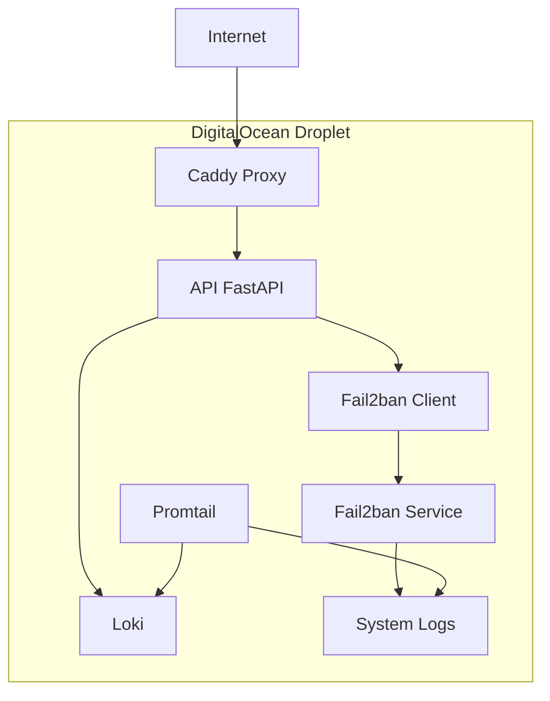

# 🛡️ Fail2ban Dashboard - Documentación Técnica

!!! info "Información del Proyecto"
    **Fecha de Documentación:** 1 de julio de 2025  
    **Proyecto:** API y Backend para Dashboard de Monitoreo de Logs de Fail2ban  
    **Proveedor de VM:** DigitalOcean Droplet  
    **Sistema Operativo:** Ubuntu 22.04 LTS  
    **Dominio Principal:** `alertasfail2ban.xmakuno.com`

## 🎯 Objetivo del Sistema

Este sistema proporciona una solución completa para el monitoreo y gestión de **Fail2ban**, incluyendo:

- 📊 **Dashboard Web** interactivo para visualización de logs
- 🔧 **API REST** para gestión de baneos y consultas
- 📈 **Monitoreo en tiempo real** de intentos de intrusión
- 🛡️ **Gestión centralizada** de jails y configuraciones

## 🏗️ Arquitectura del Sistema



## 🚀 Inicio Rápido

=== "Para Desarrolladores"

    1. **Clona el repositorio**
    ```bash
    git clone https://github.com/tu-usuario/fail2ban-dashboard.git
    cd fail2ban-dashboard
    ```

    2. **Configura el entorno**
    ```bash
    cp .env.example .env
    # Edita las variables necesarias
    ```

    3. **Ejecuta los servicios**
    ```bash
    docker compose up -d --build
    ```

=== "Para Administradores"

    1. **Accede al dashboard**
    ```
    https://alertasfail2ban.xmakuno.com
    ```

    2. **Revisa la documentación de API**
    ```
    https://alertasfail2ban.xmakuno.com/docs
    ```

    3. **Monitorea los logs**
    ```bash
    docker compose logs -f
    ```

## 📋 Características Principales

!!! success "Backend"
    - ✅ API REST con FastAPI
    - ✅ Integración con Fail2ban
    - ✅ Almacenamiento de logs con Loki
    - ✅ Proxy inverso con Caddy
    - ✅ SSL/TLS automático

!!! info "Frontend"
    - 🔄 Dashboard interactivo
    - 📊 Visualización de estadísticas
    - 🎛️ Panel de control de baneos
    - 📱 Diseño responsive

!!! warning "Seguridad"
    - 🔐 Autenticación SSH por claves
    - 🛡️ Firewall configurado
    - 🚫 Protección contra brute force
    - 📝 Auditoría de accesos

## 🗂️ Navegación de la Documentación

| Sección | Descripción |
|---------|-------------|
| [**Arquitectura**](arquitectura/overview.md) | Descripción detallada de componentes y su interacción |
| [**Configuración del Servidor**](servidor/droplet-setup.md) | Setup inicial del Droplet y configuración de seguridad |
| [**Servicios Backend**](servicios/fail2ban.md) | Documentación de cada servicio (Fail2ban, Loki, API, etc.) |
| [**Frontend Dashboard**](frontend/overview.md) | Interfaz de usuario y funcionalidades |
| [**Despliegue**](deployment/installation.md) | Instalación, mantenimiento y resolución de problemas |
| [**API Reference**](api/reference.md) | Documentación completa de endpoints |