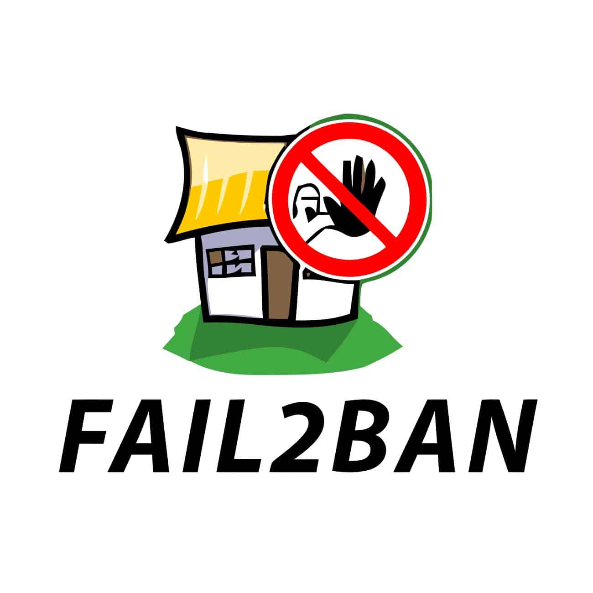
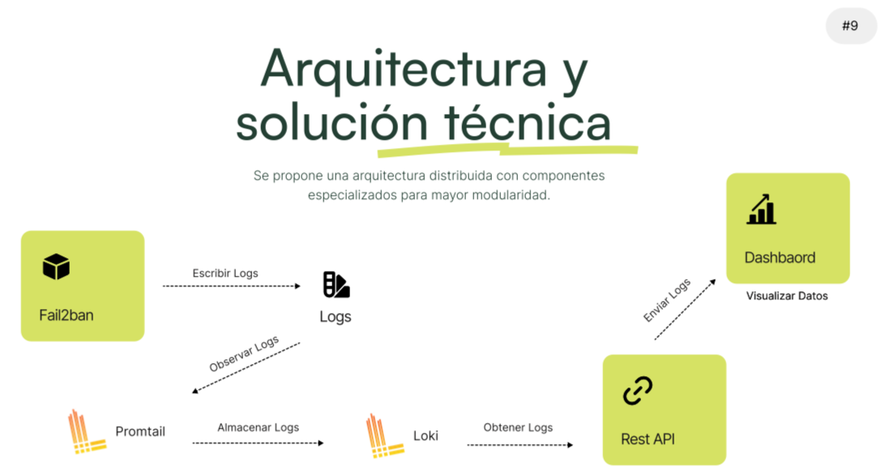

# 🛡️ Fail2ban Dashboard - Documentación Técnica

<div align="center">
  

</div>

!!! tip "Sistema en Vivo"
    🌐 **Dashboard:** [alertasfail2ban.xmakuno.com](https://alertasfail2ban.xmakuno.com)  
    📡 **API Docs:** [alertasfail2ban.xmakuno.com/docs](https://alertasfail2ban.xmakuno.com/docs)  
    📊 **Monitoreo:** [alertasfail2ban.xmakuno.com/health](https://alertasfail2ban.xmakuno.com/health)

---

## 🎯 ¿Qué es Fail2ban Dashboard?

Una **solución moderna y completa** para monitorear y gestionar Fail2ban a través de una interfaz web intuitiva y una API REST robusta.

### ✨ Características Destacadas

<div class="grid cards" markdown>

-   :material-eye:{ .lg .middle } **Monitoreo en Tiempo Real**

    ---

    Visualiza intentos de intrusión, baneos activos y estadísticas del sistema en tiempo real con WebSockets.

-   :material-api:{ .lg .middle } **API REST Completa**

    ---

    Gestiona jails, consulta logs y controla baneos a través de una API moderna con documentación automática.

-   :material-shield-check:{ .lg .middle } **Seguridad Multicapa**

    ---

    Protección con SSL/TLS, headers de seguridad, rate limiting y autenticación por claves SSH.

-   :material-responsive:{ .lg .middle } **Dashboard Responsivo**

    ---

    Interfaz moderna con Vue.js y Vuetify, optimizada para desktop, tablet y móvil.

</div>

---

## 🏗️ Arquitectura del Sistema

<div align="center">
  
</div>

### 🔧 Stack Tecnológico

=== "Backend"
    
    **API & Services**
    ```
    🐍 FastAPI          - API REST moderna
    🛡️ Fail2ban         - Sistema de prevención de intrusiones  
    🗄️ Loki             - Agregación de logs
    📜 Promtail         - Colector de logs
    🔒 Caddy            - Proxy inverso con SSL automático
    ```

=== "Frontend"
    
    **Dashboard Web**
    ```
    🖼️ Vue.js 3         - Framework reactivo
    🎨 Vuetify 3        - Componentes Material Design
    📊 Chart.js         - Gráficos y visualizaciones
    🗺️ Leaflet          - Mapas interactivos
    ⚡ Vite             - Build tool moderno
    ```

=== "Infraestructura"
    
    **Deployment & Security**
    ```
    🐳 Docker           - Containerización
    ☁️ DigitalOcean     - Cloud hosting
    🔐 Let's Encrypt    - Certificados SSL gratuitos
    🔥 UFW/iptables     - Firewall del sistema
    📝 Systemd          - Gestión de servicios
    ```

---

## 🚀 Inicio Rápido

!!! example "Desarrollo Local"

    === "🛠️ Configuración"
        
        ```bash
        # 1. Clonar repositorio
        git clone https://github.com/AleGC019/aca-fail2ban-dashboard.git
        cd aca-fail2ban-dashboard
        
        # 2. Configurar variables de entorno
        cp .env.example .env
        nano .env  # Editar configuración
        ```

    === "🐳 Docker Compose"
        
        ```bash
        # 3. Levantar servicios
        docker compose up -d --build
        
        # 4. Verificar estado
        docker compose ps
        docker compose logs -f
        ```
        
    === "🌐 Acceso"
        
        ```bash
        # Frontend
        http://localhost:3000
        
        # API Documentation  
        http://localhost:8000/docs
        
        # Health Check
        curl http://localhost:8000/health
        ```

!!! success "Producción"

    === "🌍 Acceso Directo"
        
        **Dashboard Principal**  
        [https://alertasfail2ban.xmakuno.com](https://alertasfail2ban.xmakuno.com)
        
        **API Interactiva**  
        [https://alertasfail2ban.xmakuno.com/docs](https://alertasfail2ban.xmakuno.com/docs)

    === "📊 Monitoreo"
        
        ```bash
        # Estado del sistema
        curl https://alertasfail2ban.xmakuno.com/health
        
        # Jails activos
        curl https://alertasfail2ban.xmakuno.com/api/jails
        
        # Logs recientes
        curl https://alertasfail2ban.xmakuno.com/api/logs?limit=10
        ```

---

## � Documentación Completa

<div class="grid cards" markdown>

-   :material-hammer-wrench:{ .lg .middle } [**Arquitectura**](arquitectura/overview.md)

    ---
    
    Diseño del sistema, componentes y flujo de datos

-   :material-server:{ .lg .middle } [**Configuración del Servidor**](servidor/droplet-setup.md)

    ---
    
    Setup del Droplet, seguridad y software base

-   :material-cog:{ .lg .middle } [**Servicios Backend**](servicios/fail2ban.md)

    ---
    
    Fail2ban, Loki, Promtail, Caddy y API

-   :material-monitor:{ .lg .middle } [**Frontend Dashboard**](frontend/features.md)

    ---
    
    Interfaz web, componentes y funcionalidades

-   :material-rocket-launch:{ .lg .middle } [**Despliegue**](deployment/installation.md)

    ---
    
    Instalación, mantenimiento y troubleshooting

-   :material-api:{ .lg .middle } [**API Reference**](api/reference.md)

    ---
    
    Documentación completa de endpoints REST

</div>

---

## 📊 Estado del Sistema

!!! info "Información del Proyecto"
    
    | Aspecto | Detalle |
    |---------|---------|
    | **📅 Documentación** | 1 de julio de 2025 |
    | **🔗 Repositorio** | [GitHub - ACA Fail2ban Dashboard](https://github.com/AleGC019/aca-fail2ban-dashboard) |
    | **☁️ Hosting** | DigitalOcean Droplet Ubuntu 22.04 LTS |
    | **🌐 Dominio** | `alertasfail2ban.xmakuno.com` |
    | **🔒 SSL** | Let's Encrypt (Renovación automática) |
    | **📈 Uptime** | 99.9% SLA objetivo |

### 🏷️ Etiquetas del Proyecto

```
#fail2ban #security #monitoring #fastapi #vue3 #docker #digitalocean #ubuntu #ssl #api-rest #dashboard #logs #intrusion-prevention #cybersecurity #devops
```

---
