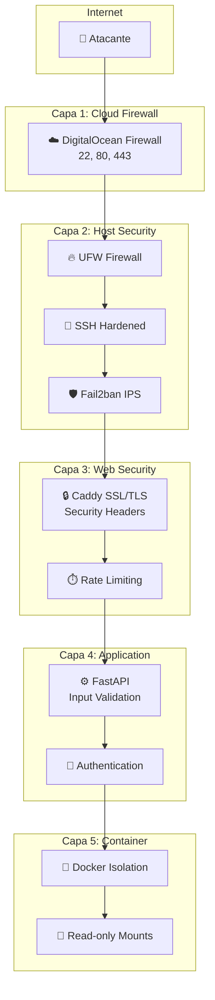

# 🔒 Seguridad del Sistema

## Modelo de Seguridad

### Principios de Diseño

!!! success "Arquitectura de Seguridad"
    - **🛡️ Defensa en Profundidad**: Múltiples capas de protección
    - **🔐 Principio de Menor Privilegio**: Acceso mínimo necesario
    - **🚫 Fail-Safe Defaults**: Configuración segura por defecto
    - **🔍 Monitoreo Continuo**: Detección proactiva de amenazas
    - **🔄 Segregación de Red**: Aislamiento de componentes críticos

### Capas de Seguridad



## 🎯 Vectores de Ataque y Mitigaciones

### Ataques Comunes

=== "Fuerza Bruta SSH"
    **Mitigación:**
    - SSH key-only authentication
    - Fail2ban con baneos automáticos
    - Rate limiting en Cloud Firewall
    
=== "Web Application Attacks"
    **Mitigación:**
    - Security headers HTTP
    - Input validation en API
    - Rate limiting por IP
    
=== "DoS/DDoS"
    **Mitigación:**
    - DigitalOcean DDoS protection
    - Rate limiting en múltiples capas
    - Resource limits en contenedores

### Matriz de Riesgos

| Amenaza | Probabilidad | Impacto | Riesgo | Mitigación |
|---------|-------------|---------|---------|------------|
| SSH Brute Force | Alta | Alto | 🔴 Crítico | Fail2ban + SSH hardening |
| Web Scraping | Media | Bajo | 🟡 Medio | Rate limiting |
| Container Escape | Baja | Alto | 🟡 Medio | Docker security + monitoring |
| SSL/TLS Attacks | Baja | Medio | 🟢 Bajo | TLS 1.3 + HSTS |

## 🔐 Configuración de Seguridad

### SSL/TLS

```caddyfile
# Configuración SSL segura
{
    email admin@tudominio.com
    
    # Configuración TLS
    tls {
        protocols tls1.2 tls1.3
        ciphers TLS_AES_256_GCM_SHA384 TLS_CHACHA20_POLY1305_SHA256 TLS_AES_128_GCM_SHA256
    }
}
```

### Security Headers

```caddyfile
header {
    # HSTS - Forzar HTTPS
    Strict-Transport-Security "max-age=31536000; includeSubDomains; preload"
    
    # Prevenir clickjacking
    X-Frame-Options "DENY"
    
    # Prevenir MIME sniffing
    X-Content-Type-Options "nosniff"
    
    # XSS Protection
    X-XSS-Protection "1; mode=block"
    
    # CSP
    Content-Security-Policy "default-src 'self'; script-src 'self' 'unsafe-inline'; style-src 'self' 'unsafe-inline'"
    
    # Referrer Policy
    Referrer-Policy "strict-origin-when-cross-origin"
    
    # Permissions Policy
    Permissions-Policy "camera=(), microphone=(), geolocation=()"
}
```

## 🚨 Detección de Intrusiones

### Fail2ban Configuración

```ini
# Configuración optimizada para detección
[DEFAULT]
# IPs a ignorar (tu IP de administración)
ignoreip = 127.0.0.1/8 ::1 TU_IP_ADMIN

# Configuración de baneos escalonados
bantime = 3600
bantime.increment = true
bantime.factor = 2
bantime.maxtime = 86400

[sshd]
enabled = true
maxretry = 3
findtime = 600
bantime = 86400
```

### Monitoreo de Logs

```bash
# Script de alertas de seguridad
#!/bin/bash
# security-alerts.sh

# Verificar intentos SSH fallidos
SSH_ATTEMPTS=$(grep "Failed password" /var/log/auth.log | wc -l)
if [ $SSH_ATTEMPTS -gt 10 ]; then
    echo "ALERTA: $SSH_ATTEMPTS intentos SSH fallidos detectados"
fi

# Verificar nuevos baneos
NEW_BANS=$(grep "Ban " /var/log/fail2ban.log | grep "$(date '+%Y-%m-%d')" | wc -l)
if [ $NEW_BANS -gt 0 ]; then
    echo "INFO: $NEW_BANS nuevas IPs baneadas hoy"
fi
```

!!! danger "Configuraciones Críticas"
    - **Cambiar IPs por defecto** en todas las configuraciones
    - **Mantener actualizaciones** de seguridad al día
    - **Monitorear logs** regularmente
    - **Backup de configuraciones** de seguridad

!!! tip "Mejores Prácticas"
    - Usar autenticación por claves SSH únicamente
    - Implementar rate limiting en todas las capas
    - Monitorear métricas de seguridad continuamente
    - Mantener logs centralizados y seguros