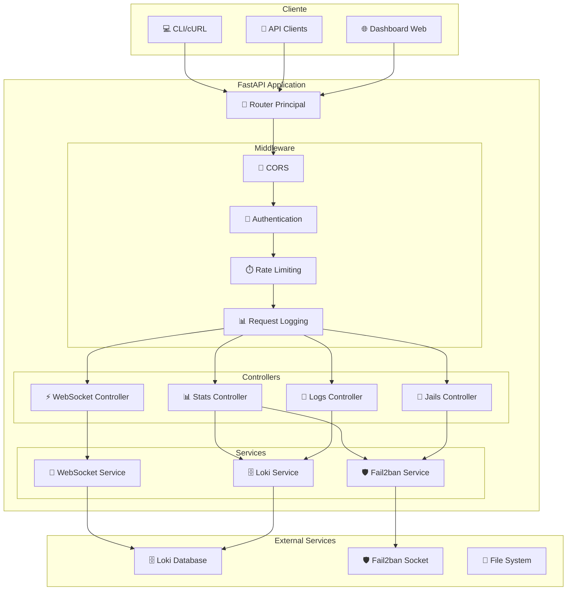

# ⚙️ FastAPI Backend

## Introducción

**FastAPI** es el núcleo backend del sistema que proporciona la API REST, WebSockets para tiempo real, y la interfaz web. Actúa como el orquestador central que conecta todos los servicios y expone la funcionalidad a través de endpoints HTTP.

## 🎯 Funciones Principales

### Características Clave

!!! success "Capacidades de FastAPI"
    - **🌐 API REST Completa**: Endpoints para gestión de jails, logs y estadísticas
    - **⚡ WebSockets**: Streaming de logs en tiempo real
    - **📚 Documentación Automática**: Swagger UI y ReDoc generados automáticamente
    - **🔗 Integración Multi-servicio**: Conecta Fail2ban, Loki y servicios externos
    - **🎨 Interfaz Web**: Dashboard completo servido desde el mismo backend
    - **🛡️ Validación de Datos**: Validación automática con Pydantic
    - **📊 Métricas y Monitoreo**: Endpoints de health check y métricas

### Arquitectura de la API



## 📁 Estructura del Proyecto

### Organización de Archivos

```
api/
├── main.py                     # Aplicación principal FastAPI
├── Dockerfile                  # Configuración Docker
├── requirements.txt            # Dependencias Python
├── .env                       # Variables de entorno
├── 
├── controllers/               # Endpoints REST organizados
│   ├── __init__.py
│   ├── logs_controller.py     # Endpoints de logs
│   ├── jails_controller.py    # Endpoints de jails
│   ├── stats_controller.py    # Endpoints de estadísticas
│   ├── websocket_controller.py # WebSocket endpoints
│   └── health_controller.py   # Health checks
├── 
├── services/                  # Lógica de negocio
│   ├── __init__.py
│   ├── loki_service.py        # Integración con Loki
│   ├── fail2ban_service.py    # Integración con Fail2ban
│   ├── websocket_service.py   # Gestión de WebSockets
│   └── cache_service.py       # Cache y optimización
├── 
├── data/                      # Modelos de datos
│   ├── __init__.py
│   ├── log_models.py          # Modelos para logs
│   ├── jail_models.py         # Modelos para jails
│   ├── stats_models.py        # Modelos para estadísticas
│   └── response_models.py     # Modelos de respuesta
├── 
├── configuration/             # Configuración de la app
│   ├── __init__.py
│   ├── settings.py            # Configuración principal
│   ├── database.py            # Configuración de BD (futuro)
│   └── middleware.py          # Middleware personalizado
├── 
├── utils/                     # Utilidades comunes
│   ├── __init__.py
│   ├── logger.py              # Configuración de logging
│   ├── validators.py          # Validadores personalizados
│   └── helpers.py             # Funciones auxiliares
├── 
├── static/                    # Archivos estáticos
│   ├── css/
│   │   ├── main.css
│   │   └── dashboard.css
│   ├── js/
│   │   ├── main.js
│   │   ├── dashboard.js
│   │   └── websocket.js
│   └── img/
│       └── favicon.ico
├── 
└── templates/                 # Templates HTML
    ├── base.html              # Template base
    ├── dashboard.html         # Dashboard principal
    ├── logs.html              # Vista de logs
    └── jails.html             # Vista de jails
```

## ⚙️ Configuración

### Variables de Entorno

```python
# configuration/settings.py
from pydantic_settings import BaseSettings
from typing import Optional
import os

class Settings(BaseSettings):
    # Configuración de la aplicación
    app_name: str = "Fail2ban Dashboard API"
    app_version: str = "1.0.0"
    debug: bool = False
    
    # Configuración del servidor
    host: str = "0.0.0.0"
    port: int = 8000
    reload: bool = False
    
    # Configuración de Loki
    loki_url: str = "http://loki:3100"
    loki_query_url: str = "http://loki:3100/loki/api/v1/query_range"
    loki_ws_url: str = "ws://loki:3100/loki/api/v1/tail"
    loki_timeout: int = 30
    
    # Configuración de Fail2ban
    fail2ban_socket_path: str = "/var/run/fail2ban/fail2ban.sock"
    fail2ban_log_path: str = "/var/log/fail2ban.log"
    fail2ban_timeout: int = 10
    
    # Configuración de logging
    log_level: str = "INFO"
    log_format: str = "json"
    log_file: Optional[str] = None
    
    # Configuración de CORS
    cors_origins: list = ["*"]
    cors_credentials: bool = True
    cors_methods: list = ["*"]
    cors_headers: list = ["*"]
    
    # Configuración de rate limiting
    rate_limit_requests: int = 100
    rate_limit_window: int = 60  # segundos
    
    # Configuración de cache
    cache_ttl: int = 300  # 5 minutos
    cache_max_size: int = 1000
    
    # Configuración de dominio
    domain_name: str = "alertasfail2ban.xmakuno.com"
    api_base_url: str = "https://alertasfail2ban.xmakuno.com"
    
    # Configuración de seguridad
    secret_key: str = "change-this-in-production"
    access_token_expire_minutes: int = 30
    
    class Config:
        env_file = ".env"
        case_sensitive = False

# Instancia global de configuración
settings = Settings()
```

### Aplicación Principal

```python
# main.py
from fastapi import FastAPI, Request
from fastapi.staticfiles import StaticFiles
from fastapi.templating import Jinja2Templates
from fastapi.middleware.cors import CORSMiddleware
from fastapi.middleware.gzip import GZipMiddleware
import uvicorn
import logging

from configuration.settings import settings
from configuration.middleware import LoggingMiddleware, RateLimitMiddleware
from controllers import (
    logs_controller,
    jails_controller, 
    stats_controller,
    websocket_controller,
    health_controller
)
from utils.logger import setup_logging

# Configurar logging
setup_logging()
logger = logging.getLogger(__name__)

# Crear aplicación FastAPI
app = FastAPI(
    title=settings.app_name,
    version=settings.app_version,
    description="API para monitoreo y gestión de Fail2ban",
    docs_url="/docs" if settings.debug else None,
    redoc_url="/redoc" if settings.debug else None,
    openapi_url="/openapi.json" if settings.debug else None,
)

# Configurar middleware
app.add_middleware(
    CORSMiddleware,
    allow_origins=settings.cors_origins,
    allow_credentials=settings.cors_credentials,
    allow_methods=settings.cors_methods,
    allow_headers=settings.cors_headers,
)

app.add_middleware(GZipMiddleware, minimum_size=1000)
app.add_middleware(LoggingMiddleware)
app.add_middleware(RateLimitMiddleware)

# Montar archivos estáticos
app.mount("/static", StaticFiles(directory="static"), name="static")

# Configurar templates
templates = Jinja2Templates(directory="templates")

# Incluir routers
app.include_router(health_controller.router)
app.include_router(logs_controller.router)
app.include_router(jails_controller.router)
app.include_router(stats_controller.router)
app.include_router(websocket_controller.router)

# Ruta principal - Dashboard
@app.get("/")
async def dashboard(request: Request):
    """Página principal del dashboard"""
    return templates.TemplateResponse("dashboard.html", {
        "request": request,
        "title": "Fail2ban Dashboard",
        "api_base_url": settings.api_base_url
    })

# Ruta de información de la API
@app.get("/info")
async def api_info():
    """Información general de la API"""
    return {
        "name": settings.app_name,
        "version": settings.app_version,
        "description": "API REST para monitoreo de seguridad con Fail2ban",
        "endpoints": {
            "health": "/health",
            "logs": "/api/logs",
            "jails": "/api/jails", 
            "stats": "/api/stats",
            "websocket": "/ws",
            "documentation": "/docs" if settings.debug else "disabled"
        }
    }

# Manejador de eventos de inicio
@app.on_event("startup")
async def startup_event():
    """Inicialización de la aplicación"""
    logger.info(f"Iniciando {settings.app_name} v{settings.app_version}")
    logger.info(f"Configuración: Debug={settings.debug}, Host={settings.host}:{settings.port}")
    
    # Verificar conectividad con servicios externos
    from services.loki_service import LokiService
    from services.fail2ban_service import Fail2banService
    
    loki_service = LokiService()
    fail2ban_service = Fail2banService()
    
    # Test de conectividad
    try:
        await loki_service.health_check()
        logger.info("✅ Conexión con Loki establecida")
    except Exception as e:
        logger.warning(f"⚠️ No se pudo conectar con Loki: {e}")
    
    try:
        fail2ban_service.get_status()
        logger.info("✅ Conexión con Fail2ban establecida")
    except Exception as e:
        logger.warning(f"⚠️ No se pudo conectar con Fail2ban: {e}")

# Manejador de eventos de cierre
@app.on_event("shutdown")
async def shutdown_event():
    """Limpieza al cerrar la aplicación"""
    logger.info(f"Cerrando {settings.app_name}")

if __name__ == "__main__":
    uvicorn.run(
        "main:app",
        host=settings.host,
        port=settings.port,
        reload=settings.reload,
        log_level=settings.log_level.lower(),
        access_log=True,
        proxy_headers=True,
        forwarded_allow_ips="*"
    )
```

## 📡 Endpoints de la API

### Controlador de Logs

```python
# controllers/logs_controller.py
from fastapi import APIRouter, HTTPException, Query, Depends
from typing import Optional, List
from datetime import datetime, timedelta
import logging

from services.loki_service import LokiService
from data.log_models import LogEntry, LogQuery, LogResponse
from utils.validators import validate_time_range, validate_log_level

router = APIRouter(prefix="/api/logs", tags=["logs"])
logger = logging.getLogger(__name__)

def get_loki_service() -> LokiService:
    return LokiService()

@router.get("/", response_model=LogResponse)
async def get_logs(
    start_time: Optional[str] = Query(None, description="Fecha inicio (ISO format)"),
    end_time: Optional[str] = Query(None, description="Fecha fin (ISO format)"),
    jail: Optional[str] = Query(None, description="Filtrar por jail específico"),
    level: Optional[str] = Query(None, description="Nivel de log (INFO, WARNING, ERROR)"),
    limit: int = Query(100, ge=1, le=1000, description="Número máximo de resultados"),
    search: Optional[str] = Query(None, description="Buscar texto en logs"),
    loki_service: LokiService = Depends(get_loki_service)
) -> LogResponse:
    """
    Obtener logs de Fail2ban con filtros opcionales
    
    - **start_time**: Fecha de inicio en formato ISO (ej: 2024-01-20T10:00:00Z)
    - **end_time**: Fecha de fin en formato ISO
    - **jail**: Filtrar por jail específico (sshd, caddy, etc.)
    - **level**: Nivel de log (INFO, WARNING, ERROR, DEBUG)
    - **limit**: Número máximo de resultados (1-1000)
    - **search**: Buscar texto específico en los logs
    """
    try:
        # Validar y establecer tiempos por defecto
        if not end_time:
            end_time = datetime.utcnow()
        else:
            end_time = datetime.fromisoformat(end_time.replace('Z', '+00:00'))
            
        if not start_time:
            start_time = end_time - timedelta(hours=24)  # Último día por defecto
        else:
            start_time = datetime.fromisoformat(start_time.replace('Z', '+00:00'))
        
        # Validar rango de tiempo
        validate_time_range(start_time, end_time)
        
        # Validar nivel de log
        if level:
            validate_log_level(level)
        
        # Crear query para Loki
        query_params = LogQuery(
            start_time=start_time,
            end_time=end_time,
            jail=jail,
            level=level,
            limit=limit,
            search=search
        )
        
        # Ejecutar consulta
        logs = await loki_service.query_logs(query_params)
        
        return LogResponse(
            logs=logs,
            total=len(logs),
            start_time=start_time,
            end_time=end_time,
            filters={
                "jail": jail,
                "level": level,
                "search": search
            }
        )
        
    except ValueError as e:
        raise HTTPException(status_code=400, detail=f"Error en parámetros: {str(e)}")
    except Exception as e:
        logger.error(f"Error obteniendo logs: {str(e)}")
        raise HTTPException(status_code=500, detail="Error interno del servidor")

@router.get("/recent", response_model=List[LogEntry])
async def get_recent_logs(
    minutes: int = Query(60, ge=1, le=1440, description="Minutos hacia atrás"),
    jail: Optional[str] = Query(None, description="Filtrar por jail"),
    loki_service: LokiService = Depends(get_loki_service)
) -> List[LogEntry]:
    """
    Obtener logs recientes de los últimos N minutos
    """
    try:
        end_time = datetime.utcnow()
        start_time = end_time - timedelta(minutes=minutes)
        
        query_params = LogQuery(
            start_time=start_time,
            end_time=end_time,
            jail=jail,
            limit=500
        )
        
        logs = await loki_service.query_logs(query_params)
        return logs
        
    except Exception as e:
        logger.error(f"Error obteniendo logs recientes: {str(e)}")
        raise HTTPException(status_code=500, detail="Error interno del servidor")

@router.get("/stats")
async def get_log_stats(
    hours: int = Query(24, ge=1, le=168, description="Horas hacia atrás para estadísticas"),
    loki_service: LokiService = Depends(get_loki_service)
):
    """
    Obtener estadísticas de logs por período de tiempo
    """
    try:
        end_time = datetime.utcnow()
        start_time = end_time - timedelta(hours=hours)
        
        stats = await loki_service.get_log_stats(start_time, end_time)
        return stats
        
    except Exception as e:
        logger.error(f"Error obteniendo estadísticas: {str(e)}")
        raise HTTPException(status_code=500, detail="Error interno del servidor")
```

### Controlador de WebSockets

```python
# controllers/websocket_controller.py
from fastapi import APIRouter, WebSocket, WebSocketDisconnect, Depends
from typing import Optional
import json
import logging
import asyncio

from services.websocket_service import WebSocketService, ConnectionManager
from services.loki_service import LokiService

router = APIRouter(tags=["websocket"])
logger = logging.getLogger(__name__)

# Gestor global de conexiones WebSocket
manager = ConnectionManager()

def get_websocket_service() -> WebSocketService:
    return WebSocketService()

@router.websocket("/ws/logs")
async def websocket_logs(
    websocket: WebSocket,
    jail: Optional[str] = None,
    level: Optional[str] = None,
    ws_service: WebSocketService = Depends(get_websocket_service)
):
    """
    WebSocket para streaming de logs en tiempo real
    
    Query parameters:
    - jail: Filtrar por jail específico
    - level: Filtrar por nivel de log
    """
    await manager.connect(websocket)
    logger.info(f"Nueva conexión WebSocket establecida. Filtros: jail={jail}, level={level}")
    
    try:
        # Configurar filtros
        filters = {}
        if jail:
            filters['jail'] = jail
        if level:
            filters['level'] = level
        
        # Iniciar streaming de logs
        await ws_service.stream_logs(websocket, filters)
        
    except WebSocketDisconnect:
        logger.info("Conexión WebSocket cerrada por el cliente")
    except Exception as e:
        logger.error(f"Error en WebSocket: {str(e)}")
        await websocket.close(code=1011, reason="Error interno del servidor")
    finally:
        manager.disconnect(websocket)

@router.websocket("/ws/stats")
async def websocket_stats(websocket: WebSocket):
    """
    WebSocket para estadísticas en tiempo real
    """
    await manager.connect(websocket)
    logger.info("Nueva conexión WebSocket para estadísticas")
    
    try:
        while True:
            # Enviar estadísticas cada 30 segundos
            from services.fail2ban_service import Fail2banService
            from services.loki_service import LokiService
            
            fail2ban_service = Fail2banService()
            loki_service = LokiService()
            
            stats = {
                "timestamp": datetime.utcnow().isoformat(),
                "fail2ban": fail2ban_service.get_general_stats(),
                "system": await loki_service.get_system_stats()
            }
            
            await websocket.send_text(json.dumps(stats))
            await asyncio.sleep(30)
            
    except WebSocketDisconnect:
        logger.info("Conexión WebSocket de estadísticas cerrada")
    except Exception as e:
        logger.error(f"Error en WebSocket stats: {str(e)}")
    finally:
        manager.disconnect(websocket)

@router.get("/ws/status")
async def websocket_status():
    """
    Estado de las conexiones WebSocket activas
    """
    return {
        "active_connections": len(manager.active_connections),
        "connections": [
            {
                "id": id(conn),
                "client": f"{conn.client.host}:{conn.client.port}" if conn.client else "unknown"
            } 
            for conn in manager.active_connections
        ]
    }
```

## 🔧 Servicios

### Servicio de Loki

```python
# services/loki_service.py
import aiohttp
import asyncio
import json
from datetime import datetime
from typing import List, Optional, Dict, Any
import logging

from configuration.settings import settings
from data.log_models import LogEntry, LogQuery
from utils.helpers import format_loki_time

logger = logging.getLogger(__name__)

class LokiService:
    def __init__(self):
        self.base_url = settings.loki_url
        self.query_url = f"{self.base_url}/loki/api/v1/query_range"
        self.labels_url = f"{self.base_url}/loki/api/v1/labels"
        self.timeout = aiohttp.ClientTimeout(total=settings.loki_timeout)
    
    async def health_check(self) -> bool:
        """Verificar conectividad con Loki"""
        try:
            async with aiohttp.ClientSession(timeout=self.timeout) as session:
                async with session.get(f"{self.base_url}/ready") as response:
                    return response.status == 200
        except Exception as e:
            logger.error(f"Health check failed: {e}")
            return False
    
    async def query_logs(self, query_params: LogQuery) -> List[LogEntry]:
        """Consultar logs en Loki con parámetros específicos"""
        try:
            # Construir query LogQL
            logql_query = self._build_logql_query(query_params)
            
            # Parámetros para la API de Loki
            params = {
                'query': logql_query,
                'start': format_loki_time(query_params.start_time),
                'end': format_loki_time(query_params.end_time),
                'limit': query_params.limit,
                'direction': 'backward'  # Más recientes primero
            }
            
            async with aiohttp.ClientSession(timeout=self.timeout) as session:
                async with session.get(self.query_url, params=params) as response:
                    if response.status != 200:
                        error_text = await response.text()
                        raise Exception(f"Loki API error: {response.status} - {error_text}")
                    
                    data = await response.json()
                    return self._parse_loki_response(data)
                    
        except Exception as e:
            logger.error(f"Error querying Loki: {e}")
            raise
    
    def _build_logql_query(self, params: LogQuery) -> str:
        """Construir query LogQL basado en parámetros"""
        # Query base para logs de fail2ban
        base_query = '{job="fail2ban"}'
        
        filters = []
        
        # Filtro por jail
        if params.jail:
            filters.append(f'jail="{params.jail}"')
        
        # Filtro por nivel
        if params.level:
            filters.append(f'level="{params.level.upper()}"')
        
        # Agregar filtros a la query
        if filters:
            filter_str = ', '.join(filters)
            query = f'{{{base_query[1:-1]}, {filter_str}}}'
        else:
            query = base_query
        
        # Filtro por texto de búsqueda
        if params.search:
            query += f' |~ "(?i){params.search}"'  # Case insensitive search
        
        return query
    
    def _parse_loki_response(self, data: Dict[str, Any]) -> List[LogEntry]:
        """Parsear respuesta de Loki a LogEntry objects"""
        logs = []
        
        try:
            if 'data' not in data or 'result' not in data['data']:
                return logs
            
            for stream in data['data']['result']:
                stream_labels = stream.get('stream', {})
                
                for entry in stream.get('values', []):
                    timestamp_ns = int(entry[0])
                    log_line = entry[1]
                    
                    # Convertir timestamp de nanosegundos a datetime
                    timestamp = datetime.fromtimestamp(timestamp_ns / 1_000_000_000)
                    
                    # Parsear log line si es JSON
                    try:
                        log_data = json.loads(log_line)
                        message = log_data.get('message', log_line)
                    except:
                        message = log_line
                        log_data = {}
                    
                    log_entry = LogEntry(
                        timestamp=timestamp,
                        level=stream_labels.get('level', 'INFO'),
                        jail=stream_labels.get('jail', ''),
                        component=stream_labels.get('component', 'fail2ban'),
                        message=message,
                        raw_log=log_line,
                        labels=stream_labels
                    )
                    
                    logs.append(log_entry)
            
            # Ordenar por timestamp (más reciente primero)
            logs.sort(key=lambda x: x.timestamp, reverse=True)
            
        except Exception as e:
            logger.error(f"Error parsing Loki response: {e}")
            raise
        
        return logs
    
    async def get_log_stats(self, start_time: datetime, end_time: datetime) -> Dict[str, Any]:
        """Obtener estadísticas de logs por período"""
        try:
            stats = {}
            
            # Query para contar logs por nivel
            level_query = 'sum by (level) (count_over_time({job="fail2ban"}[1h]))'
            
            # Query para contar logs por jail
            jail_query = 'sum by (jail) (count_over_time({job="fail2ban"}[1h]))'
            
            async with aiohttp.ClientSession(timeout=self.timeout) as session:
                # Estadísticas por nivel
                params = {
                    'query': level_query,
                    'start': format_loki_time(start_time),
                    'end': format_loki_time(end_time),
                    'step': '3600'  # 1 hora
                }
                
                async with session.get(self.query_url, params=params) as response:
                    if response.status == 200:
                        data = await response.json()
                        stats['by_level'] = self._parse_stats_response(data)
                
                # Estadísticas por jail
                params['query'] = jail_query
                async with session.get(self.query_url, params=params) as response:
                    if response.status == 200:
                        data = await response.json()
                        stats['by_jail'] = self._parse_stats_response(data)
            
            return stats
            
        except Exception as e:
            logger.error(f"Error getting log stats: {e}")
            return {}
    
    def _parse_stats_response(self, data: Dict[str, Any]) -> Dict[str, int]:
        """Parsear respuesta de estadísticas"""
        stats = {}
        
        try:
            for result in data.get('data', {}).get('result', []):
                metric = result.get('metric', {})
                values = result.get('values', [])
                
                # Obtener el label (level o jail)
                label = metric.get('level') or metric.get('jail', 'unknown')
                
                # Sumar todos los valores
                total = sum(float(value[1]) for value in values)
                stats[label] = int(total)
                
        except Exception as e:
            logger.error(f"Error parsing stats response: {e}")
        
        return stats
    
    async def get_system_stats(self) -> Dict[str, Any]:
        """Obtener estadísticas generales del sistema"""
        try:
            async with aiohttp.ClientSession(timeout=self.timeout) as session:
                async with session.get(f"{self.base_url}/metrics") as response:
                    if response.status == 200:
                        metrics_text = await response.text()
                        return self._parse_prometheus_metrics(metrics_text)
            return {}
        except Exception as e:
            logger.error(f"Error getting system stats: {e}")
            return {}
    
    def _parse_prometheus_metrics(self, metrics_text: str) -> Dict[str, Any]:
        """Parsear métricas de Prometheus de Loki"""
        stats = {}
        try:
            for line in metrics_text.split('\n'):
                if line.startswith('loki_ingester_streams_total'):
                    stats['total_streams'] = float(line.split()[-1])
                elif line.startswith('loki_distributor_lines_received_total'):
                    stats['lines_received'] = float(line.split()[-1])
        except Exception as e:
            logger.error(f"Error parsing metrics: {e}")
        
        return stats
```

## 🐳 Configuración Docker

### Dockerfile

```dockerfile
# Dockerfile
FROM python:3.11-slim

# Metadatos
LABEL maintainer="tu_email@example.com"
LABEL description="FastAPI backend for Fail2ban Dashboard"

# Variables de entorno
ENV PYTHONUNBUFFERED=1
ENV PYTHONDONTWRITEBYTECODE=1
ENV DEBIAN_FRONTEND=noninteractive

# Crear usuario no-root
RUN groupadd -r appuser && useradd -r -g appuser appuser

# Instalar dependencias del sistema
RUN apt-get update && apt-get install -y \
    fail2ban \
    curl \
    && rm -rf /var/lib/apt/lists/*

# Crear directorio de la aplicación
WORKDIR /app

# Copiar requirements primero para aprovechar cache de Docker
COPY requirements.txt .

# Instalar dependencias Python
RUN pip install --no-cache-dir --upgrade pip && \
    pip install --no-cache-dir -r requirements.txt

# Copiar código de la aplicación
COPY . .

# Crear directorio para logs
RUN mkdir -p /app/logs && chown -R appuser:appuser /app

# Cambiar a usuario no-root
USER appuser

# Exponer puerto
EXPOSE 8000

# Health check
HEALTHCHECK --interval=30s --timeout=10s --start-period=5s --retries=3 \
    CMD curl -f http://localhost:8000/health || exit 1

# Comando por defecto
CMD ["uvicorn", "main:app", "--host", "0.0.0.0", "--port", "8000", "--proxy-headers", "--forwarded-allow-ips", "*"]
```

### Dependencias

```txt
# requirements.txt
fastapi==0.104.1
uvicorn[standard]==0.24.0
pydantic==2.5.0
pydantic-settings==2.1.0
aiohttp==3.9.1
jinja2==3.1.2
python-multipart==0.0.6
python-jose[cryptography]==3.3.0
passlib[bcrypt]==1.7.4
websockets==12.0
prometheus-client==0.19.0
structlog==23.2.0
rich==13.7.0
cachetools==5.3.2
```

!!! tip "Optimizaciones de Performance"
    - **Cache de respuestas** para consultas frecuentes
    - **Conexiones persistentes** a Loki con connection pooling
    - **Rate limiting** para prevenir abuse
    - **Compresión GZIP** para respuestas grandes
    - **Paginación** en endpoints que retornan muchos datos

!!! warning "Consideraciones de Seguridad"
    - **Validación estricta** de todos los parámetros de entrada
    - **Rate limiting** en endpoints públicos
    - **Headers de seguridad** configurados en middleware
    - **Logging de accesos** para auditoría
    - **Timeout configurado** para prevenir ataques de lenta conexión

!!! success "Próximo Paso"
    Explora la documentación de [Loki](loki.md) para entender cómo la API consulta y procesa los logs almacenados.