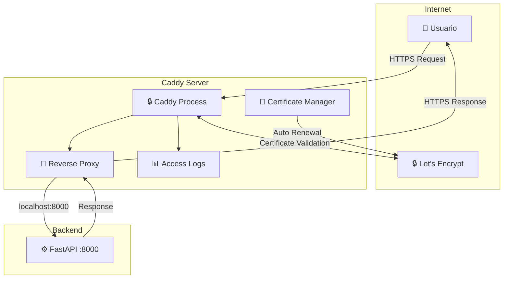

# 🔒 Caddy Web Server

## Introducción

**Caddy** es el servidor web y proxy inverso que actúa como puerta de entrada al sistema. Maneja automáticamente los certificados SSL, enruta el tráfico HTTPS y proporciona una capa adicional de seguridad.

## 🎯 Funciones Principales

### Características Clave

!!! success "Capacidades de Caddy"
    - **🔒 HTTPS Automático**: Obtención y renovación automática de certificados SSL con Let's Encrypt
    - **🔄 Proxy Inverso**: Enrutamiento de tráfico hacia la API FastAPI
    - **🛡️ Headers de Seguridad**: Configuración automática de headers HTTP seguros
    - **📊 Logging Avanzado**: Logs estructurados en formato JSON
    - **⚡ High Performance**: Servidor web moderno y eficiente

### Arquitectura de Caddy



## ⚙️ Configuración

### Archivo Caddyfile Principal

```caddyfile
# /etc/caddy/Caddyfile
{
    # Configuración global
    email tu_email@example.com
    
    # Configuración de logs globales
    log {
        level INFO
        format json
    }
    
    # Configuración de certificados
    acme_ca https://acme-v02.api.letsencrypt.org/directory
    
    # Configuración de almacenamiento
    storage file_system {
        root /var/lib/caddy
    }
}

# Configuración principal del sitio
alertasfail2ban.xmakuno.com {
    # Proxy inverso hacia FastAPI
    reverse_proxy localhost:8000 {
        # Headers para proxy
        header_up Host {host}
        header_up X-Real-IP {remote_host}
        header_up X-Forwarded-For {remote_host}
        header_up X-Forwarded-Proto {scheme}
        header_up X-Forwarded-Host {host}
        header_up X-Forwarded-Port {server_port}
        
        # Health check del backend
        health_uri /health
        health_interval 30s
        health_timeout 5s
        
        # Configuración de timeouts
        transport http {
            dial_timeout 10s
            response_header_timeout 30s
        }
    }

    # Headers de seguridad
    header {
        # HSTS - HTTP Strict Transport Security
        Strict-Transport-Security "max-age=31536000; includeSubDomains; preload"
        
        # Prevenir clickjacking
        X-Frame-Options "DENY"
        
        # Prevenir MIME type sniffing
        X-Content-Type-Options "nosniff"
        
        # XSS Protection
        X-XSS-Protection "1; mode=block"
        
        # Referrer Policy
        Referrer-Policy "strict-origin-when-cross-origin"
        
        # Content Security Policy
        Content-Security-Policy "default-src 'self'; script-src 'self' 'unsafe-inline' 'unsafe-eval'; style-src 'self' 'unsafe-inline'; img-src 'self' data: https:; font-src 'self' data:; connect-src 'self' wss: ws:; frame-ancestors 'none';"
        
        # Permissions Policy
        Permissions-Policy "camera=(), microphone=(), geolocation=(), payment=()"
        
        # Server header (ocultar información)
        -Server
        -X-Powered-By
    }

    # Rate limiting
    rate_limit {
        zone dynamic {
            key {remote_host}
            events 100
            window 1m
        }
        
        zone api {
            key {remote_host}
            events 30
            window 1m
            match {
                path /api/*
            }
        }
    }

    # Logging de acceso
    log {
        output file /var/log/caddy/access.log {
            roll_size 100mb
            roll_keep 10
            roll_keep_for 720h  # 30 días
        }
        format json {
            time_format "2006-01-02T15:04:05.000Z07:00"
            message_key "msg"
            level_key "level"
            time_key "ts"
        }
        include http.request.host http.request.method http.request.uri
        include http.request.headers.User-Agent
        include http.response.status http.response.size
        include http.response.duration
    }

    # Manejo de errores personalizado
    handle_errors {
        @5xx expression {http.error.status_code} >= 500
        @4xx expression {http.error.status_code} >= 400 && {http.error.status_code} < 500
        @404 expression {http.error.status_code} == 404
        
        respond @5xx `
        <!DOCTYPE html>
        <html>
        <head><title>Error del Servidor</title></head>
        <body style="font-family: Arial, sans-serif; text-align: center; padding: 50px;">
            <h1>Error Interno del Servidor</h1>
            <p>El servicio está temporalmente no disponible. Por favor intenta más tarde.</p>
            <p><small>Error: {http.error.status_code}</small></p>
        </body>
        </html>
        ` 500 {
            header Content-Type "text/html; charset=utf-8"
        }
        
        respond @404 `
        <!DOCTYPE html>
        <html>
        <head><title>Página No Encontrada</title></head>
        <body style="font-family: Arial, sans-serif; text-align: center; padding: 50px;">
            <h1>404 - Página No Encontrada</h1>
            <p>La página que buscas no existe.</p>
            <p><a href="/">Volver al inicio</a></p>
        </body>
        </html>
        ` 404 {
            header Content-Type "text/html; charset=utf-8"
        }
        
        respond @4xx `
        <!DOCTYPE html>
        <html>
        <head><title>Error de Cliente</title></head>
        <body style="font-family: Arial, sans-serif; text-align: center; padding: 50px;">
            <h1>Error en la Solicitud</h1>
            <p>Tu solicitud no pudo ser procesada.</p>
            <p><small>Error: {http.error.status_code}</small></p>
        </body>
        </html>
        ` {http.error.status_code} {
            header Content-Type "text/html; charset=utf-8"
        }
    }

    # Compresión
    encode {
        gzip 6
        zstd
        minimum_length 1024
        match {
            header Content-Type text/*
            header Content-Type application/json*
            header Content-Type application/javascript*
            header Content-Type application/xhtml+xml*
            header Content-Type application/atom+xml*
            header Content-Type image/svg+xml*
        }
    }
}

# Redirección de www a dominio principal
www.alertasfail2ban.xmakuno.com {
    redir https://alertasfail2ban.xmakuno.com{uri} permanent
}

# Configuración para desarrollo local (opcional)
localhost:8080 {
    reverse_proxy localhost:8000
    tls internal
}
```

### Variables de Entorno

```bash
# /etc/default/caddy
# Variables de entorno para Caddy

# Usuario y grupo
CADDY_USER=caddy
CADDY_GROUP=caddy

# Directorio de configuración
CADDY_CONFIG_DIR=/etc/caddy

# Directorio de datos
CADDY_DATA_DIR=/var/lib/caddy

# Archivo de log de errores
CADDY_ERROR_LOG=/var/log/caddy/error.log

# Configuraciones adicionales
CADDY_ADMIN_LISTEN=localhost:2019
CADDY_HTTP_PORT=80
CADDY_HTTPS_PORT=443

# Let's Encrypt configuración
ACME_EMAIL=tu_email@example.com
ACME_CA_SERVER=https://acme-v02.api.letsencrypt.org/directory
```

## 🚀 Instalación y Configuración

### Instalación en Ubuntu 22.04

```bash
# Instalar dependencias
sudo apt install -y debian-keyring debian-archive-keyring apt-transport-https

# Agregar clave GPG de Caddy
curl -1sLf 'https://dl.cloudsmith.io/public/caddy/stable/gpg.key' | sudo gpg --dearmor -o /usr/share/keyrings/caddy-stable-archive-keyring.gpg

# Agregar repositorio
curl -1sLf 'https://dl.cloudsmith.io/public/caddy/stable/debian.deb.txt' | sudo tee /etc/apt/sources.list.d/caddy-stable.list

# Actualizar repositorios e instalar
sudo apt update
sudo apt install caddy

# Verificar instalación
caddy version
```

### Configuración Inicial

```bash
# Crear directorios necesarios
sudo mkdir -p /etc/caddy
sudo mkdir -p /var/log/caddy
sudo mkdir -p /var/lib/caddy

# Configurar permisos
sudo chown -R caddy:caddy /var/log/caddy
sudo chown -R caddy:caddy /var/lib/caddy
sudo chmod 755 /etc/caddy

# Crear Caddyfile inicial
sudo nano /etc/caddy/Caddyfile

# Validar configuración
sudo caddy validate --config /etc/caddy/Caddyfile

# Habilitar y iniciar servicio
sudo systemctl enable caddy
sudo systemctl start caddy
sudo systemctl status caddy
```

### Configuración de Systemd

```ini
# /etc/systemd/system/caddy.service
[Unit]
Description=Caddy
Documentation=https://caddyserver.com/docs/
After=network.target network-online.target
Requires=network-online.target

[Service]
Type=notify
User=caddy
Group=caddy
ExecStart=/usr/bin/caddy run --environ --config /etc/caddy/Caddyfile
ExecReload=/usr/bin/caddy reload --config /etc/caddy/Caddyfile --force
TimeoutStopSec=5s
LimitNOFILE=1048576
LimitNPROC=1048576
PrivateTmp=true
ProtectSystem=full
AmbientCapabilities=CAP_NET_BIND_SERVICE

[Install]
WantedBy=multi-user.target
```

## 🔐 Gestión de Certificados SSL

### Configuración Automática

!!! info "Let's Encrypt Automático"
    Caddy maneja automáticamente:
    
    - **Obtención inicial** de certificados SSL/TLS
    - **Validación de dominio** via HTTP-01 challenge
    - **Renovación automática** antes del vencimiento (30 días antes)
    - **Configuración HTTPS** automática con redirección HTTP → HTTPS

### Comandos de Gestión

```bash
# Listar certificados actuales
sudo caddy list-certificates

# Verificar estado de certificado específico
sudo caddy list-certificates --format json | jq '.[] | select(.names[] | contains("alertasfail2ban.xmakuno.com"))'

# Forzar renovación de certificado
sudo systemctl stop caddy
sudo rm -rf /var/lib/caddy/.local/share/caddy/certificates/acme-v02.api.letsencrypt.org-directory/
sudo systemctl start caddy

# Verificar logs de renovación
sudo journalctl -u caddy -f --since "1 hour ago"
```

### Verificación Manual de SSL

```bash
# Verificar certificado desde línea de comandos
echo | openssl s_client -servername alertasfail2ban.xmakuno.com -connect alertasfail2ban.xmakuno.com:443 2>/dev/null | openssl x509 -noout -text

# Verificar fechas de validez
echo | openssl s_client -servername alertasfail2ban.xmakuno.com -connect alertasfail2ban.xmakuno.com:443 2>/dev/null | openssl x509 -noout -dates

# Verificar cadena de certificados
echo | openssl s_client -servername alertasfail2ban.xmakuno.com -connect alertasfail2ban.xmakuno.com:443 -showcerts 2>/dev/null
```

## 📊 Logging y Monitoreo

### Configuración de Logs

```bash
# Estructura de logs
/var/log/caddy/
├── access.log          # Logs de acceso en formato JSON
├── access.log.1        # Rotación automática
├── access.log.2.gz     # Compresión automática
└── error.log           # Logs de errores del sistema
```

### Análisis de Logs

=== "Logs de Acceso"
    ```bash
    # Ver logs en tiempo real
    sudo tail -f /var/log/caddy/access.log | jq
    
    # Filtrar por códigos de estado
    jq 'select(.resp_status >= 400)' /var/log/caddy/access.log
    
    # Top IPs por número de requests
    jq -r '.request.remote_ip' /var/log/caddy/access.log | sort | uniq -c | sort -nr | head -10
    
    # Análisis de User-Agents
    jq -r '.request.headers["User-Agent"][0]' /var/log/caddy/access.log | sort | uniq -c | sort -nr
    
    # Requests por hora
    jq -r '.ts[:13]' /var/log/caddy/access.log | sort | uniq -c
    ```

=== "Logs de Errores"
    ```bash
    # Ver errores recientes
    sudo journalctl -u caddy --since "1 hour ago" --priority err
    
    # Seguir logs en tiempo real
    sudo journalctl -u caddy -f
    
    # Filtrar por tipos de mensaje
    sudo journalctl -u caddy | grep -i "certificate"
    sudo journalctl -u caddy | grep -i "error"
    ```

### Métricas y Estadísticas

```bash
#!/bin/bash
# caddy-stats.sh - Script para estadísticas de Caddy

echo "=== ESTADÍSTICAS DE CADDY ==="
echo "Fecha: $(date)"
echo "================================"

# Estado del servicio
echo "📊 Estado del servicio:"
sudo systemctl status caddy --no-pager -l

# Estadísticas de acceso (últimas 24h)
echo -e "\n📈 Estadísticas de acceso (24h):"
if [ -f /var/log/caddy/access.log ]; then
    echo "Total requests: $(wc -l < /var/log/caddy/access.log)"
    echo "Requests únicos por IP:"
    jq -r '.request.remote_ip' /var/log/caddy/access.log 2>/dev/null | sort | uniq -c | sort -nr | head -5 || echo "Error procesando logs"
    echo "Status codes:"
    jq -r '.resp_status' /var/log/caddy/access.log 2>/dev/null | sort | uniq -c | sort -nr || echo "Error procesando logs"
fi

# Información de certificados
echo -e "\n🔒 Certificados SSL:"
sudo caddy list-certificates 2>/dev/null | head -20 || echo "Error obteniendo certificados"

# Uso de memoria y CPU
echo -e "\n💻 Recursos del proceso:"
ps aux | grep caddy | grep -v grep

echo -e "\n================================"
```

## 🛡️ Configuración de Seguridad

### Headers de Seguridad Explicados

!!! abstract "Headers de Seguridad Implementados"
    
    === "HSTS (HTTP Strict Transport Security)"
        ```caddyfile
        Strict-Transport-Security "max-age=31536000; includeSubDomains; preload"
        ```
        - Fuerza conexiones HTTPS por 1 año
        - Incluye subdominios
        - Elegible para HSTS preload list
    
    === "Clickjacking Protection"
        ```caddyfile
        X-Frame-Options "DENY"
        ```
        - Previene embebido en iframes
        - Protege contra ataques de clickjacking
    
    === "MIME Type Sniffing"
        ```caddyfile
        X-Content-Type-Options "nosniff"
        ```
        - Previene interpretación incorrecta de archivos
        - Reduce riesgo de XSS
    
    === "XSS Protection"
        ```caddyfile
        X-XSS-Protection "1; mode=block"
        ```
        - Activa filtro XSS del navegador
        - Bloquea páginas con XSS detectado
    
    === "Content Security Policy"
        ```caddyfile
        Content-Security-Policy "default-src 'self'; script-src 'self' 'unsafe-inline'..."
        ```
        - Controla recursos que puede cargar la página
        - Previene XSS y injection attacks

### Rate Limiting

```caddyfile
# Configuración avanzada de rate limiting
rate_limit {
    # Límite general por IP
    zone general {
        key {remote_host}
        events 100
        window 1m
    }
    
    # Límite específico para API
    zone api {
        key {remote_host}
        events 30
        window 1m
        match {
            path /api/*
        }
    }
    
    # Límite para autenticación
    zone auth {
        key {remote_host}
        events 5
        window 5m
        match {
            path /auth/*
            method POST
        }
    }
    
    # Límite por User-Agent (bots)
    zone bots {
        key {request.header.user-agent}
        events 10
        window 1m
        match {
            header User-Agent *bot*
        }
    }
}
```

### Configuración Anti-DDoS

```caddyfile
# Protección adicional contra DDoS
alertasfail2ban.xmakuno.com {
    # ... configuración base ...
    
    # Límites de conexión
    limits {
        max_request_body_size 10MB
        max_request_header_size 1MB
    }
    
    # Timeouts agresivos
    timeouts {
        read_timeout 30s
        read_header_timeout 10s
        write_timeout 30s
        idle_timeout 120s
    }
    
    # Filtros geográficos (opcional)
    @blocked_countries {
        remote_ip 1.2.3.0/24 5.6.7.0/24  # Rangos IP específicos
    }
    respond @blocked_countries "Access denied" 403
    
    # Bloqueo de User-Agents maliciosos
    @malicious_agents {
        header User-Agent *sqlmap*
        header User-Agent *nikto*
        header User-Agent *nmap*
        header User-Agent *scanner*
    }
    respond @malicious_agents "Forbidden" 403
}
```

## ⚡ Optimización de Performance

### Configuración de Caché

```caddyfile
# Headers de caché para recursos estáticos
@static {
    path *.css *.js *.png *.jpg *.jpeg *.gif *.ico *.svg *.woff *.woff2
}

header @static {
    Cache-Control "public, max-age=31536000, immutable"
    ETag {file.hash}
}

# Headers de caché para API responses
@api {
    path /api/*
}

header @api {
    Cache-Control "no-cache, no-store, must-revalidate"
    Pragma "no-cache"
    Expires "0"
}
```

### Configuración de Compresión

```caddyfile
# Compresión optimizada
encode {
    # Algoritmos de compresión (orden de preferencia)
    zstd
    gzip 6
    
    # Tamaño mínimo para comprimir
    minimum_length 1024
    
    # Tipos MIME a comprimir
    match {
        header Content-Type text/*
        header Content-Type application/json*
        header Content-Type application/javascript*
        header Content-Type application/xml*
        header Content-Type application/xhtml+xml*
        header Content-Type application/atom+xml*
        header Content-Type application/rss+xml*
        header Content-Type image/svg+xml*
    }
}
```

### Optimización de Conexiones

```caddyfile
# Configuración de transporte HTTP optimizada
servers {
    protocols h1 h2 h3
    
    # HTTP/2 settings
    h2c on
    
    # HTTP/3 settings (experimental)
    experimental_http3
    
    # Configuración de timeouts
    timeouts {
        read_timeout 30s
        read_header_timeout 10s
        write_timeout 30s
        idle_timeout 120s
    }
    
    # Límites de conexión
    max_header_size 1MB
    max_request_body_size 10MB
}
```

## 🔧 Troubleshooting

### Problemas Comunes

=== "Certificado SSL No Se Obtiene"
    ```bash
    # Verificar conectividad a Let's Encrypt
    curl -I https://acme-v02.api.letsencrypt.org/directory
    
    # Verificar DNS
    dig alertasfail2ban.xmakuno.com
    
    # Verificar puerto 80 abierto
    sudo netstat -tlnp | grep :80
    
    # Logs específicos de certificados
    sudo journalctl -u caddy | grep -i certificate
    
    # Probar validación manual
    sudo caddy validate --config /etc/caddy/Caddyfile
    ```

=== "Error 502 Bad Gateway"
    ```bash
    # Verificar que backend esté corriendo
    curl http://localhost:8000/health
    
    # Verificar configuración de proxy
    sudo caddy validate --config /etc/caddy/Caddyfile
    
    # Logs de errores de proxy
    sudo journalctl -u caddy | grep -i "proxy\|upstream\|backend"
    
    # Probar conectividad directa
    telnet localhost 8000
    ```

=== "Rate Limiting Muy Agresivo"
    ```bash
    # Verificar configuración actual
    curl -I https://alertasfail2ban.xmakuno.com/
    
    # Ajustar límites en Caddyfile
    # Aumentar events o window en rate_limit
    
    # Recargar configuración
    sudo systemctl reload caddy
    
    # Verificar logs de rate limiting
    sudo grep -i "rate limit" /var/log/caddy/access.log
    ```

### Comandos de Diagnóstico

```bash
#!/bin/bash
# caddy-diagnostics.sh

echo "=== DIAGNÓSTICO DE CADDY ==="

# 1. Estado del servicio
echo "📊 Estado del servicio:"
sudo systemctl status caddy --no-pager

# 2. Validación de configuración
echo -e "\n✅ Validación de configuración:"
sudo caddy validate --config /etc/caddy/Caddyfile

# 3. Puertos en uso
echo -e "\n🌐 Puertos en uso:"
sudo netstat -tlnp | grep -E ":(80|443|2019)"

# 4. Certificados
echo -e "\n🔒 Certificados:"
sudo caddy list-certificates | head -10

# 5. Últimos errores
echo -e "\n❌ Últimos errores:"
sudo journalctl -u caddy --since "1 hour ago" --priority err --no-pager

# 6. Test de conectividad
echo -e "\n🔌 Test de conectividad:"
if curl -s -I http://localhost:80 >/dev/null; then
    echo "✅ Puerto 80: OK"
else
    echo "❌ Puerto 80: FAIL"
fi

if curl -s -I https://localhost:443 >/dev/null 2>&1; then
    echo "✅ Puerto 443: OK"
else
    echo "❌ Puerto 443: FAIL"
fi

# 7. Uso de recursos
echo -e "\n💻 Uso de recursos:"
ps aux | grep caddy | grep -v grep

echo -e "\n=== FIN DIAGNÓSTICO ==="
```

!!! tip "Mejores Prácticas"
    1. **Siempre valida** la configuración antes de recargar
    2. **Monitorea logs** regularmente para detectar problemas
    3. **Mantén backups** de configuraciones que funcionan
    4. **Prueba certificados** periódicamente
    5. **Actualiza Caddy** regularmente para parches de seguridad

!!! success "Próximo Paso"
    Revisa la documentación de [Fail2ban](fail2ban.md) para entender cómo se integra con Caddy para proporcionar seguridad adicional.