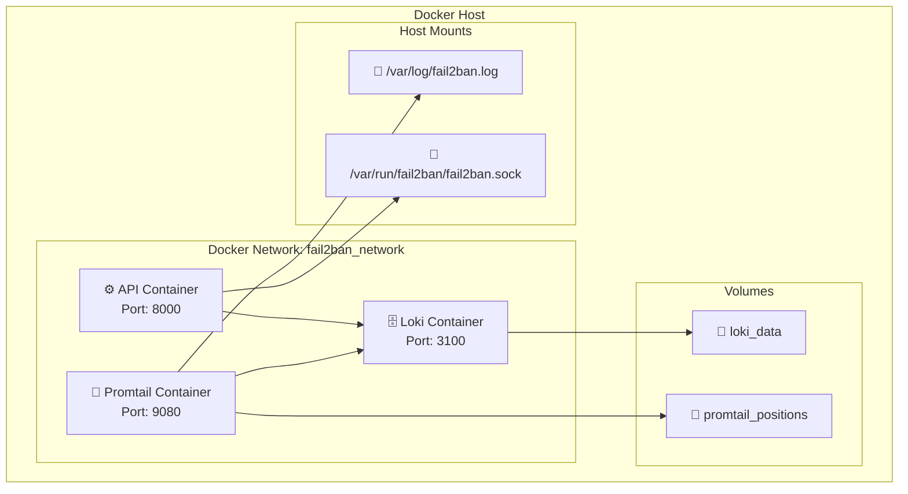

# 🐳 Docker y Orquestación

## Introducción

**Docker** proporciona la plataforma de containerización que permite ejecutar todos los servicios del sistema de manera aislada, portable y escalable. El sistema utiliza Docker Compose para orquestar múltiples contenedores.

## 🎯 Funciones Principales

### Características Clave

!!! success "Capacidades de Docker"
    - **🔒 Aislamiento**: Cada servicio ejecuta en su propio contenedor
    - **📦 Portabilidad**: Mismo comportamiento en desarrollo y producción
    - **⚡ Escalabilidad**: Fácil escalamiento horizontal de servicios
    - **🔄 Orquestación**: Gestión coordinada con Docker Compose
    - **💾 Persistencia**: Volúmenes para datos críticos
    - **🌐 Networking**: Red interna segura entre contenedores

### Arquitectura Docker



## ⚙️ Configuración Docker Compose

### Archivo Principal

```yaml
# docker-compose.yaml
version: '3.8'

services:
  # API FastAPI
  api:
    build: 
      context: ./api
      dockerfile: Dockerfile
    container_name: fail2ban-api
    restart: unless-stopped
    ports:
      - "127.0.0.1:8000:8000"  # Solo localhost
    volumes:
      - /var/run/fail2ban/fail2ban.sock:/var/run/fail2ban/fail2ban.sock
      - /var/log/fail2ban.log:/var/log/fail2ban.log:ro
    environment:
      - LOKI_QUERY_URL=http://loki:3100/loki/api/v1/query_range
      - LOKI_WS_URL=ws://loki:3100/loki/api/v1/tail
      - FAIL2BAN_SOCKET_PATH=/var/run/fail2ban/fail2ban.sock
    depends_on:
      - loki
    networks:
      - fail2ban_network
    healthcheck:
      test: ["CMD", "curl", "-f", "http://localhost:8000/health"]
      interval: 30s
      timeout: 10s
      retries: 3

  # Loki Log Storage
  loki:
    image: grafana/loki:latest
    container_name: fail2ban-loki
    restart: unless-stopped
    ports:
      - "127.0.0.1:3100:3100"  # Solo red Docker
    volumes:
      - ./loki/config.yaml:/etc/loki/local-config.yaml:ro
      - loki_data:/loki
    command: -config.file=/etc/loki/local-config.yaml
    networks:
      - fail2ban_network
    healthcheck:
      test: ["CMD-SHELL", "wget --no-verbose --tries=1 --spider http://localhost:3100/ready || exit 1"]
      interval: 30s
      timeout: 10s
      retries: 3

  # Promtail Log Collector
  promtail:
    image: grafana/promtail:latest
    container_name: fail2ban-promtail
    restart: unless-stopped
    volumes:
      - ./promtail/promtail.yaml:/etc/promtail/config.yml:ro
      - /var/log/fail2ban.log:/var/log/fail2ban.log:ro
      - promtail_positions:/tmp/positions
    command: -config.file=/etc/promtail/config.yml
    depends_on:
      - loki
    networks:
      - fail2ban_network
    healthcheck:
      test: ["CMD-SHELL", "wget --no-verbose --tries=1 --spider http://localhost:9080/ready || exit 1"]
      interval: 30s
      timeout: 10s
      retries: 3

# Volúmenes persistentes
volumes:
  loki_data:
    driver: local
  promtail_positions:
    driver: local

# Red interna
networks:
  fail2ban_network:
    driver: bridge
    internal: false
```

## 🔧 Comandos Útiles

### Gestión de Servicios

```bash
# Iniciar todos los servicios
docker compose up -d

# Ver estado de servicios
docker compose ps

# Ver logs en tiempo real
docker compose logs -f

# Reiniciar un servicio específico
docker compose restart api

# Detener todos los servicios
docker compose down

# Rebuild y restart
docker compose up -d --build --force-recreate
```

### Monitoreo y Debugging

```bash
# Estadísticas de recursos
docker stats

# Inspeccionar contenedor
docker inspect fail2ban-api

# Ejecutar comando en contenedor
docker exec -it fail2ban-api bash

# Ver volúmenes
docker volume ls
docker volume inspect aca-fail2ban-dashboard_loki_data
```

## 📊 Gestión de Recursos

### Límites de Recursos

```yaml
# Configuración con límites de recursos
services:
  api:
    deploy:
      resources:
        limits:
          memory: 512M
          cpus: '0.5'
        reservations:
          memory: 256M
          cpus: '0.25'

  loki:
    deploy:
      resources:
        limits:
          memory: 1G
          cpus: '1.0'
        reservations:
          memory: 512M
          cpus: '0.5'

  promtail:
    deploy:
      resources:
        limits:
          memory: 128M
          cpus: '0.2'
        reservations:
          memory: 64M
          cpus: '0.1'
```

## 🔒 Seguridad y Networking

### Configuración de Red

```yaml
# Red personalizada con configuración avanzada
networks:
  fail2ban_network:
    driver: bridge
    driver_opts:
      com.docker.network.enable_ipv6: "false"
    ipam:
      driver: default
      config:
        - subnet: 172.20.0.0/16
          gateway: 172.20.0.1
```

### Variables de Entorno Seguras

```bash
# .env - Variables de entorno
COMPOSE_PROJECT_NAME=aca-fail2ban-dashboard
LOKI_RETENTION_PERIOD=744h
API_LOG_LEVEL=INFO
PROMTAIL_LOG_LEVEL=info

# Configuración de red
DOCKER_NETWORK_SUBNET=172.20.0.0/16
```

!!! tip "Mejores Prácticas Docker"
    - **Usa .dockerignore** para excluir archivos innecesarios
    - **Multi-stage builds** para imágenes más pequeñas
    - **Health checks** para todos los servicios críticos
    - **Límites de recursos** para prevenir consumo excesivo
    - **Volúmenes named** para persistencia de datos

!!! warning "Consideraciones de Seguridad"
    - **Solo expón puertos necesarios** al host
    - **Usa redes internas** para comunicación entre contenedores
    - **Monta volúmenes como read-only** cuando sea posible
    - **Mantén imágenes actualizadas** regularmente

!!! success "Próximo Paso"
    Revisa la documentación de [troubleshooting](../deployment/troubleshooting.md) para resolver problemas comunes con Docker.