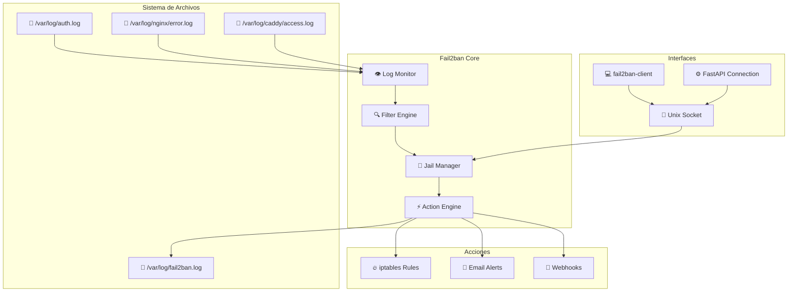

# 🛡️ Fail2ban Security System

## Introducción

**Fail2ban** es el sistema de prevención de intrusiones (IPS) que monitorea logs del sistema en tiempo real y aplica baneos automáticos a IPs que muestran comportamiento malicioso. Es el corazón de la seguridad del sistema.

## 🎯 Funciones Principales

### Características Clave

!!! success "Capacidades de Fail2ban"
    - **🔍 Monitoreo en Tiempo Real**: Análisis continuo de logs del sistema
    - **🚫 Baneos Automáticos**: Aplicación automática de reglas de firewall
    - **🏢 Múltiples Jails**: Protección para diferentes servicios (SSH, HTTP, etc.)
    - **⏱️ Baneos Temporales**: Configuración flexible de tiempos de baneo
    - **🔗 Integración iptables**: Aplicación directa de reglas de firewall
    - **📊 Logging Detallado**: Registro completo de actividad maliciosa

### Arquitectura de Fail2ban



## ⚙️ Configuración

### Estructura de Configuración

```bash
/etc/fail2ban/
├── fail2ban.conf          # Configuración principal (NO MODIFICAR)
├── fail2ban.local         # Override de configuración principal
├── jail.conf              # Configuración de jails (NO MODIFICAR)
├── jail.local             # Override de jails personalizadas
├── jail.d/                # Configuraciones específicas por servicio
│   ├── defaults-debian.conf
│   ├── sshd.local
│   └── caddy.local
├── filter.d/              # Filtros para detectar patrones
│   ├── sshd.conf
│   ├── nginx-http-auth.conf
│   └── caddy.conf
├── action.d/              # Acciones a ejecutar
│   ├── iptables-multiport.conf
│   ├── sendmail.conf
│   └── webhook.conf
└── fail2ban.d/            # Configuraciones adicionales
```

### Configuración Principal

```ini
# /etc/fail2ban/jail.local
[DEFAULT]
# IPs que nunca serán baneadas (IMPORTANTE: Agregar tu IP)
ignoreip = 127.0.0.1/8 ::1 TU_IP_PUBLICA_AQUI

# Tiempo de banneo por defecto (segundos)
bantime = 3600          # 1 hora

# Incremento de tiempo para baneos repetidos
bantime.increment = true
bantime.factor = 2
bantime.multipliers = 2 4 8 16 32 64
bantime.maxtime = 86400  # Máximo 24 horas

# Ventana de tiempo para contar intentos fallidos (segundos)
findtime = 600          # 10 minutos

# Número máximo de intentos fallidos antes del baneo
maxretry = 5

# Configuración de backend
backend = auto
usedns = warn

# Configuración de logging
logtarget = /var/log/fail2ban.log
loglevel = INFO
syslogsocket = auto

# Configuración de email (opcional)
destemail = admin@tudominio.com
sendername = Fail2ban-Alert
mta = sendmail

# Acción por defecto
action = %(action_mwl)s  # Ban + email con logs

# Configuración de base de datos
dbfile = /var/lib/fail2ban/fail2ban.sqlite3
dbpurgeage = 86400      # Purgar registros más antiguos de 1 día

#
# CONFIGURACIÓN DE JAILS ESPECÍFICOS
#

# Protección SSH
[sshd]
enabled = true
port = ssh
filter = sshd
logpath = /var/log/auth.log
maxretry = 3
bantime = 86400         # 24 horas para SSH
findtime = 600          # 10 minutos
action = %(action_mwl)s

# Protección para Caddy
[caddy]
enabled = true
port = http,https
filter = caddy
logpath = /var/log/caddy/access.log
maxretry = 10
bantime = 3600          # 1 hora
findtime = 600          # 10 minutos

# Protección para fuerza bruta HTTP
[http-get-dos]
enabled = true
port = http,https
filter = http-get-dos
logpath = /var/log/caddy/access.log
maxretry = 300
findtime = 300          # 5 minutos
bantime = 600           # 10 minutos ban

# Protección para escaneo de puertos
[portscan]
enabled = true
filter = portscan
logpath = /var/log/syslog
maxretry = 6
findtime = 600
bantime = 86400         # 24 horas

# Protección para intentos de exploit
[apache-badbots]
enabled = true
port = http,https
filter = apache-badbots
logpath = /var/log/caddy/access.log
maxretry = 2
bantime = 172800        # 48 horas

# Protección para overflow de requests
[apache-overflows]
enabled = true
port = http,https
filter = apache-overflows
logpath = /var/log/caddy/access.log
maxretry = 2
bantime = 172800        # 48 horas
```

### Filtros Personalizados

=== "Filtro para Caddy"
    ```ini
    # /etc/fail2ban/filter.d/caddy.conf
    [Definition]
    
    # Patrón para detectar requests maliciosos en logs de Caddy
    failregex = ^.*"remote_ip":"<HOST>".*"status":(?:400|401|403|404|405|408|409|410|412|413|414|417|429|500|502|503|504).*$
                ^.*"remote_ip":"<HOST>".*"user_agent":".*(?:sqlmap|nikto|nmap|scanner|bot).*".*$
                ^.*"remote_ip":"<HOST>".*"uri":".*(?:\.php|\.asp|\.jsp|admin|wp-admin|phpmyadmin).*".*$
    
    # Patrón para ignorar (IPs locales, health checks, etc.)
    ignoreregex = ^.*"remote_ip":"(?:127\.0\.0\.1|::1)".*$
                  ^.*"user_agent":".*(?:HealthCheck|Monitoring|Pingdom).*".*$
    
    # Configuración del filtro
    datepattern = "ts":"%%Y-%%m-%%dT%%H:%%M:%%S"
    ```

=== "Filtro para DoS HTTP"
    ```ini
    # /etc/fail2ban/filter.d/http-get-dos.conf
    [Definition]
    
    # Detectar muchos requests GET en poco tiempo
    failregex = ^.*"remote_ip":"<HOST>".*"method":"GET".*$
    
    # Ignorar requests legítimos
    ignoreregex = ^.*"user_agent":".*(?:GoogleBot|BingBot|SlackBot).*".*$
                  ^.*"uri":".*(?:\.css|\.js|\.png|\.jpg|\.ico|\.svg).*$
    
    datepattern = "ts":"%%Y-%%m-%%dT%%H:%%M:%%S"
    ```

=== "Filtro para Exploits"
    ```ini
    # /etc/fail2ban/filter.d/apache-overflows.conf
    [Definition]
    
    # Detectar intentos de overflow y exploits
    failregex = ^.*"remote_ip":"<HOST>".*"uri":".*(?:select|union|insert|drop|delete|script|alert|eval).*".*$
                ^.*"remote_ip":"<HOST>".*"uri":".*(?:\.\./|\.\.\|%2e%2e).*".*$
                ^.*"remote_ip":"<HOST>".*"uri":".*(?:exec|system|shell_exec|passthru).*".*$
    
    datepattern = "ts":"%%Y-%%m-%%dT%%H:%%M:%%S"
    ```

### Acciones Personalizadas

=== "Acción con Webhook"
    ```ini
    # /etc/fail2ban/action.d/webhook.conf
    [Definition]
    
    # Comando para ejecutar al banear
    actionstart = curl -X POST <webhook_url> \
                  -H "Content-Type: application/json" \
                  -d '{"action":"start","jail":"<name>","time":"<time>"}'
    
    actionstop = curl -X POST <webhook_url> \
                 -H "Content-Type: application/json" \
                 -d '{"action":"stop","jail":"<name>","time":"<time>"}'
    
    actionban = curl -X POST <webhook_url> \
                -H "Content-Type: application/json" \
                -d '{"action":"ban","jail":"<name>","ip":"<ip>","time":"<time>","failures":"<failures>"}'
    
    actionunban = curl -X POST <webhook_url> \
                  -H "Content-Type: application/json" \
                  -d '{"action":"unban","jail":"<name>","ip":"<ip>","time":"<time>"}'
    
    [Init]
    webhook_url = https://alertasfail2ban.xmakuno.com/api/webhooks/fail2ban
    ```

=== "Acción con Notificación Slack"
    ```ini
    # /etc/fail2ban/action.d/slack.conf
    [Definition]
    
    actionban = curl -X POST <slack_webhook_url> \
                -H "Content-Type: application/json" \
                -d '{"text":"🚨 *Fail2ban Alert*\n*IP Baneada:* `<ip>`\n*Jail:* `<name>`\n*Servidor:* `<fq-hostname>`\n*Tiempo:* `<time>`\n*Intentos fallidos:* `<failures>`"}'
    
    actionunban = curl -X POST <slack_webhook_url> \
                  -H "Content-Type: application/json" \
                  -d '{"text":"✅ *Fail2ban*\n*IP Desbaneada:* `<ip>`\n*Jail:* `<name>`\n*Servidor:* `<fq-hostname>`\n*Tiempo:* `<time>`"}'
    
    [Init]
    slack_webhook_url = https://hooks.slack.com/services/TU_WEBHOOK_AQUI
    ```

## 🚀 Instalación y Configuración

### Instalación en Ubuntu 22.04

```bash
# Instalar Fail2ban
sudo apt update
sudo apt install fail2ban

# Instalar dependencias adicionales
sudo apt install iptables-persistent

# Verificar instalación
fail2ban-client --version
sudo systemctl status fail2ban
```

### Configuración Inicial

```bash
# Crear configuración personalizada
sudo cp /etc/fail2ban/jail.conf /etc/fail2ban/jail.local

# Editar configuración principal
sudo nano /etc/fail2ban/jail.local

# Validar configuración
sudo fail2ban-client -t

# Reiniciar servicio
sudo systemctl restart fail2ban

# Habilitar al arranque
sudo systemctl enable fail2ban

# Verificar jails activos
sudo fail2ban-client status
```

### Configuración de Integración con iptables

```bash
# Verificar que iptables esté disponible
sudo iptables -L

# Crear cadenas personalizadas para Fail2ban
sudo iptables -N f2b-sshd
sudo iptables -A f2b-sshd -j RETURN
sudo iptables -I INPUT -p tcp --dport ssh -j f2b-sshd

# Guardar reglas para persistencia
sudo iptables-save > /etc/iptables/rules.v4

# Verificar integración
sudo fail2ban-client set sshd addignoreip 127.0.0.1
sudo fail2ban-client get sshd ignoreip
```

## 📊 Monitoreo y Gestión

### Comandos de Gestión Básicos

```bash
# Estado general
sudo fail2ban-client status

# Estado de jail específico
sudo fail2ban-client status sshd

# Listar IPs baneadas
sudo fail2ban-client get sshd banip

# Banear IP manualmente
sudo fail2ban-client set sshd banip 192.168.1.100

# Desbanear IP
sudo fail2ban-client set sshd unbanip 192.168.1.100

# Recargar configuración
sudo fail2ban-client reload

# Recargar jail específico
sudo fail2ban-client reload sshd
```

### Comandos de Información Avanzados

```bash
# Ver configuración actual de jail
sudo fail2ban-client get sshd logpath
sudo fail2ban-client get sshd maxretry
sudo fail2ban-client get sshd bantime
sudo fail2ban-client get sshd findtime

# Ver filtros aplicados
sudo fail2ban-client get sshd filter

# Ver acciones configuradas
sudo fail2ban-client get sshd action

# Estadísticas detalladas
sudo fail2ban-client get sshd stats

# Ver logs en tiempo real
sudo tail -f /var/log/fail2ban.log
```

### Scripts de Monitoreo

=== "Script de Estado General"
    ```bash
    #!/bin/bash
    # fail2ban-status.sh
    
    echo "=== ESTADO DE FAIL2BAN ==="
    echo "Fecha: $(date)"
    echo "=========================="
    
    # Estado del servicio
    echo "📊 Estado del servicio:"
    sudo systemctl status fail2ban --no-pager -l
    
    # Jails activos
    echo -e "\n🏢 Jails activos:"
    sudo fail2ban-client status
    
    # Estadísticas por jail
    echo -e "\n📈 Estadísticas detalladas:"
    for jail in $(sudo fail2ban-client status | grep "Jail list:" | cut -d: -f2 | tr ',' '\n' | xargs); do
        echo "  === $jail ==="
        sudo fail2ban-client status $jail
        echo ""
    done
    
    # IPs baneadas recientemente
    echo "🚫 IPs baneadas recientemente:"
    sudo grep "Ban " /var/log/fail2ban.log | tail -10
    
    echo "=========================="
    ```

=== "Script de Análisis de Logs"
    ```bash
    #!/bin/bash
    # fail2ban-analysis.sh
    
    LOG_FILE="/var/log/fail2ban.log"
    
    echo "=== ANÁLISIS DE LOGS FAIL2BAN ==="
    echo "Período: Últimas 24 horas"
    echo "================================="
    
    # Top IPs baneadas
    echo "🔴 Top 10 IPs baneadas:"
    grep "Ban " $LOG_FILE | grep "$(date '+%Y-%m-%d')" | awk '{print $NF}' | sort | uniq -c | sort -nr | head -10
    
    # Distribución por jails
    echo -e "\n🏢 Baneos por jail:"
    grep "Ban " $LOG_FILE | grep "$(date '+%Y-%m-%d')" | grep -o '\[.*\]' | sort | uniq -c | sort -nr
    
    # Actividad por horas
    echo -e "\n⏰ Actividad por horas (hoy):"
    grep "Ban " $LOG_FILE | grep "$(date '+%Y-%m-%d')" | cut -d' ' -f1-2 | cut -d':' -f1-2 | sort | uniq -c
    
    # Países más activos (requiere geoip)
    if command -v geoiplookup >/dev/null 2>&1; then
        echo -e "\n🌍 Top países atacantes:"
        grep "Ban " $LOG_FILE | grep "$(date '+%Y-%m-%d')" | awk '{print $NF}' | sort | uniq | head -20 | while read ip; do
            country=$(geoiplookup $ip | cut -d: -f2 | cut -d, -f1)
            echo "$country"
        done | sort | uniq -c | sort -nr | head -10
    fi
    
    echo "================================="
    ```

## 🔍 Integración con FastAPI

### Comunicación via Socket Unix

La API FastAPI se comunica con Fail2ban a través del socket Unix:

```python
# services/fail2ban_service.py
import socket
import json
import subprocess
from pathlib import Path

class Fail2banService:
    def __init__(self):
        self.socket_path = "/var/run/fail2ban/fail2ban.sock"
    
    def _execute_command(self, command: list) -> str:
        """Ejecutar comando fail2ban-client"""
        try:
            result = subprocess.run(
                ["fail2ban-client"] + command,
                capture_output=True,
                text=True,
                timeout=30
            )
            if result.returncode != 0:
                raise Exception(f"Error: {result.stderr}")
            return result.stdout.strip()
        except subprocess.TimeoutExpired:
            raise Exception("Timeout ejecutando comando fail2ban")
        except Exception as e:
            raise Exception(f"Error ejecutando comando: {str(e)}")
    
    def get_status(self) -> dict:
        """Obtener estado general de fail2ban"""
        try:
            output = self._execute_command(["status"])
            return {"status": "active", "output": output}
        except Exception as e:
            return {"status": "error", "error": str(e)}
    
    def get_jails(self) -> list:
        """Obtener lista de jails activos"""
        try:
            output = self._execute_command(["status"])
            jail_line = [line for line in output.split('\n') if 'Jail list:' in line][0]
            jails_str = jail_line.split(':', 1)[1].strip()
            return [jail.strip() for jail in jails_str.split(',') if jail.strip()]
        except Exception as e:
            return []
    
    def get_jail_status(self, jail: str) -> dict:
        """Obtener estado de jail específico"""
        try:
            output = self._execute_command(["status", jail])
            
            # Parsear output
            lines = output.split('\n')
            status = {}
            
            for line in lines:
                if 'Currently failed:' in line:
                    status['currently_failed'] = int(line.split(':')[1].strip())
                elif 'Total failed:' in line:
                    status['total_failed'] = int(line.split(':')[1].strip())
                elif 'Currently banned:' in line:
                    status['currently_banned'] = int(line.split(':')[1].strip())
                elif 'Total banned:' in line:
                    status['total_banned'] = int(line.split(':')[1].strip())
                elif 'Banned IP list:' in line:
                    banned_ips = line.split(':', 1)[1].strip()
                    status['banned_ips'] = [ip.strip() for ip in banned_ips.split() if ip.strip()]
            
            return status
        except Exception as e:
            return {"error": str(e)}
    
    def ban_ip(self, jail: str, ip: str) -> dict:
        """Banear IP en jail específico"""
        try:
            self._execute_command(["set", jail, "banip", ip])
            return {"success": True, "message": f"IP {ip} baneada en {jail}"}
        except Exception as e:
            return {"success": False, "error": str(e)}
    
    def unban_ip(self, jail: str, ip: str) -> dict:
        """Desbanear IP en jail específico"""
        try:
            self._execute_command(["set", jail, "unbanip", ip])
            return {"success": True, "message": f"IP {ip} desbaneada en {jail}"}
        except Exception as e:
            return {"success": False, "error": str(e)}
```

### Endpoints de la API

```python
# controllers/jails_controller.py
from fastapi import APIRouter, HTTPException
from services.fail2ban_service import Fail2banService

router = APIRouter(prefix="/api/jails", tags=["jails"])
fail2ban_service = Fail2banService()

@router.get("/")
async def get_jails():
    """Obtener lista de jails con sus estados"""
    try:
        jails = fail2ban_service.get_jails()
        result = []
        
        for jail in jails:
            status = fail2ban_service.get_jail_status(jail)
            result.append({
                "name": jail,
                "status": "active",
                **status
            })
        
        return result
    except Exception as e:
        raise HTTPException(status_code=500, detail=str(e))

@router.get("/{jail}")
async def get_jail_status(jail: str):
    """Obtener estado de jail específico"""
    try:
        status = fail2ban_service.get_jail_status(jail)
        if "error" in status:
            raise HTTPException(status_code=404, detail=status["error"])
        return status
    except Exception as e:
        raise HTTPException(status_code=500, detail=str(e))

@router.post("/{jail}/ban")
async def ban_ip(jail: str, ip: str):
    """Banear IP en jail específico"""
    try:
        result = fail2ban_service.ban_ip(jail, ip)
        if not result["success"]:
            raise HTTPException(status_code=400, detail=result["error"])
        return result
    except Exception as e:
        raise HTTPException(status_code=500, detail=str(e))

@router.post("/{jail}/unban")
async def unban_ip(jail: str, ip: str):
    """Desbanear IP en jail específico"""
    try:
        result = fail2ban_service.unban_ip(jail, ip)
        if not result["success"]:
            raise HTTPException(status_code=400, detail=result["error"])
        return result
    except Exception as e:
        raise HTTPException(status_code=500, detail=str(e))
```

## 🔧 Troubleshooting

### Problemas Comunes

=== "Fail2ban No Banea IPs"
    ```bash
    # 1. Verificar que el servicio esté activo
    sudo systemctl status fail2ban
    
    # 2. Verificar configuración
    sudo fail2ban-client -t
    
    # 3. Verificar logs
    sudo tail -f /var/log/fail2ban.log
    
    # 4. Probar filtro manualmente
    sudo fail2ban-regex /var/log/auth.log /etc/fail2ban/filter.d/sshd.conf
    
    # 5. Verificar que los logs existan y tengan contenido
    ls -la /var/log/auth.log
    sudo tail /var/log/auth.log
    
    # 6. Verificar configuración de jail
    sudo fail2ban-client get sshd logpath
    sudo fail2ban-client get sshd filter
    ```

=== "IPs Legítimas Baneadas"
    ```bash
    # 1. Desbanear inmediatamente
    sudo fail2ban-client set sshd unbanip IP_LEGITIMA
    
    # 2. Agregar a ignoreip
    sudo nano /etc/fail2ban/jail.local
    # Agregar IP a la línea ignoreip
    
    # 3. Recargar configuración
    sudo fail2ban-client reload
    
    # 4. Verificar que se aplicó
    sudo fail2ban-client get sshd ignoreip
    ```

=== "Rendimiento Lento"
    ```bash
    # 1. Verificar uso de CPU/memoria
    top -p $(pgrep fail2ban-server)
    
    # 2. Optimizar configuración
    # Reducir polling de logs
    sudo nano /etc/fail2ban/jail.local
    # Agregar: backend = polling
    
    # 3. Limpiar base de datos
    sudo fail2ban-client stop
    sudo rm /var/lib/fail2ban/fail2ban.sqlite3
    sudo systemctl start fail2ban
    
    # 4. Verificar logs grandes
    du -sh /var/log/auth.log /var/log/caddy/access.log
    ```

### Scripts de Diagnóstico

```bash
#!/bin/bash
# fail2ban-diagnostics.sh

echo "=== DIAGNÓSTICO COMPLETO DE FAIL2BAN ==="

# 1. Estado del servicio
echo "📊 Estado del servicio:"
sudo systemctl status fail2ban --no-pager

# 2. Validación de configuración
echo -e "\n✅ Validación de configuración:"
sudo fail2ban-client -t

# 3. Jails activos
echo -e "\n🏢 Jails activos:"
sudo fail2ban-client status

# 4. Verificar archivos de log
echo -e "\n📝 Archivos de log:"
for log in /var/log/auth.log /var/log/caddy/access.log /var/log/fail2ban.log; do
    if [ -f "$log" ]; then
        echo "✅ $log: $(wc -l < $log) líneas"
    else
        echo "❌ $log: NO EXISTE"
    fi
done

# 5. Verificar iptables
echo -e "\n🔥 Reglas iptables de Fail2ban:"
sudo iptables -L | grep -A 10 -B 2 f2b

# 6. Últimas actividades
echo -e "\n🚨 Últimas actividades (últimas 10):"
sudo tail -10 /var/log/fail2ban.log

# 7. Test de filtros
echo -e "\n🔍 Test de filtros principales:"
if [ -f /var/log/auth.log ]; then
    echo "Testando filtro sshd:"
    sudo fail2ban-regex /var/log/auth.log /etc/fail2ban/filter.d/sshd.conf | tail -5
fi

echo -e "\n=== FIN DIAGNÓSTICO ==="
```

!!! warning "Consideraciones de Seguridad"
    1. **Siempre incluye tu IP** en `ignoreip` para evitar auto-baneos
    2. **Monitorea logs regularmente** para detectar problemas
    3. **Mantén backups** de configuraciones funcionales
    4. **Prueba filtros** antes de ponerlos en producción
    5. **Configura alertas** para baneos de IPs críticas

!!! tip "Mejores Prácticas"
    - Usa **bantime incremental** para atacantes persistentes
    - Configura **diferentes niveles** de protección por servicio
    - Implementa **alertas por email/webhook** para eventos críticos
    - **Analiza logs** regularmente para ajustar filtros
    - **Documenta** todas las IPs en whitelist con justificación

!!! success "Próximo Paso"
    Revisa la documentación de [Docker](docker.md) para entender cómo los contenedores interactúan con Fail2ban y el sistema de logs.