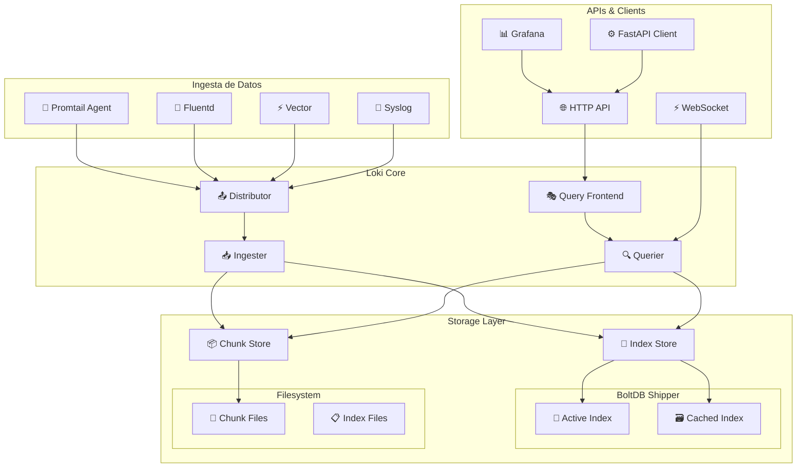
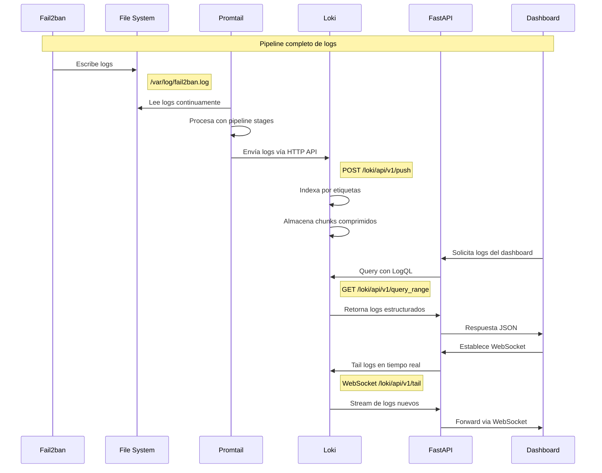

# 🗄️ Loki Log Aggregation

## Introducción

**Loki** es el sistema de agregación de logs que almacena, indexa y permite consultar todos los logs del sistema de manera eficiente. Diseñado por Grafana Labs, Loki está optimizado para manejar grandes volúmenes de logs con un enfoque en la indexación por etiquetas.

## 🎯 Funciones Principales

### Características Clave

!!! success "Capacidades de Loki"
    - **📊 Almacenamiento Distribuido**: Escalable para grandes volúmenes de logs
    - **🏷️ Indexación por Etiquetas**: Búsquedas rápidas usando labels en lugar de full-text
    - **🗜️ Compresión Eficiente**: Optimización de almacenamiento con múltiples algoritmos
    - **⏱️ Retención Configurable**: Gestión automática del ciclo de vida de logs
    - **🔍 LogQL**: Lenguaje de consulta poderoso similar a PromQL
    - **📡 API REST Completa**: Endpoints para ingesta, consulta y gestión

### Arquitectura de Loki



## ⚙️ Configuración

### Archivo de Configuración Principal

```yaml
# loki/config.yaml
auth_enabled: false

server:
  http_listen_port: 3100
  grpc_listen_port: 9096
  grpc_server_max_recv_msg_size: 104857600  # 100MB
  grpc_server_max_send_msg_size: 104857600  # 100MB
  http_server_read_timeout: 30s
  http_server_write_timeout: 30s

common:
  path_prefix: /loki
  storage:
    filesystem:
      chunks_directory: /loki/chunks
      rules_directory: /loki/rules
  replication_factor: 1
  ring:
    kvstore:
      store: inmemory

# Configuración de esquema de datos
schema_config:
  configs:
    - from: 2020-10-24
      store: boltdb-shipper
      object_store: filesystem
      schema: v11
      index:
        prefix: index_
        period: 24h

# Configuración de almacenamiento
storage_config:
  boltdb_shipper:
    active_index_directory: /loki/boltdb-shipper-active
    cache_location: /loki/boltdb-shipper-cache
    cache_ttl: 24h
    shared_store: filesystem
  filesystem:
    directory: /loki/chunks

# Límites y configuración de performance
limits_config:
  # Límites de ingesta
  ingestion_rate_mb: 4              # 4MB/s por tenant
  ingestion_burst_size_mb: 6        # Burst de 6MB
  max_streams_per_user: 10000       # Máximo streams por usuario
  max_line_size: 256000             # Máximo tamaño de línea (256KB)
  
  # Límites de consulta
  max_query_parallelism: 32         # Consultas paralelas
  max_query_time: "5m"              # Timeout de consultas
  max_query_length: "12000h"        # Máximo rango de tiempo (500 días)
  max_query_series: 500             # Máximo series por consulta
  
  # Límites de retención
  retention_period: "744h"          # 31 días de retención
  
  # Límites de streams
  max_streams_matchers_per_query: 1000
  max_concurrent_tail_requests: 10
  
  # Configuración de chunks
  max_chunk_age: "1h"               # Edad máxima de chunk antes de flush
  chunk_idle_period: "30m"          # Período de inactividad antes de flush
  chunk_block_size: 262144          # Tamaño de bloque (256KB)
  chunk_target_size: 1572864        # Tamaño objetivo de chunk (1.5MB)
  chunk_retain_period: "15m"        # Tiempo de retención en memoria

# Configuración del ciclo de vida de tablas
table_manager:
  retention_deletes_enabled: true
  retention_period: "744h"          # 31 días

# Configuración de compresión
chunk_store_config:
  max_look_back_period: "744h"      # Máximo período hacia atrás

# Configuración de consultas
query_range:
  results_cache:
    cache:
      embedded_cache:
        enabled: true
        max_size_mb: 100
        ttl: 1h
  cache_results: true
  max_retries: 5
  parallelise_shardable_queries: true
  split_queries_by_interval: 30m

# Configuración de frontend
frontend:
  max_outstanding_per_tenant: 256
  compress_responses: true

# Configuración de logging
log_level: info
log_format: json

# Configuración de métricas
analytics:
  reporting_enabled: false

# Configuración de runtime
runtime_config:
  file: /etc/loki/runtime.yaml
```

### Configuración de Runtime

```yaml
# loki/runtime.yaml
# Configuración que puede ser recargada sin reiniciar Loki

# Configuración por tenant (en caso de multi-tenancy)
overrides:
  "fake":  # tenant por defecto cuando auth_enabled=false
    ingestion_rate_mb: 8
    max_streams_per_user: 20000
    max_line_size: 512000

# Configuración global de límites
global:
  # Configuración de retención dinámica
  retention_period: "744h"
  
  # Configuración de compresión
  chunk_encoding: "gzip"
  
  # Configuración de performance
  query_timeout: "300s"
  ingestion_timeout: "60s"
```

### Docker Compose Configuration

```yaml
# docker-compose.yaml (sección de Loki)
version: '3.8'

services:
  loki:
    image: grafana/loki:latest
    container_name: fail2ban-loki
    restart: unless-stopped
    ports:
      - "3100:3100"
    volumes:
      - ./loki/config.yaml:/etc/loki/local-config.yaml:ro
      - ./loki/runtime.yaml:/etc/loki/runtime.yaml:ro
      - loki_data:/loki
    command: -config.file=/etc/loki/local-config.yaml
    environment:
      - JAEGER_AGENT_HOST=
      - JAEGER_ENDPOINT=
      - JAEGER_SAMPLER_TYPE=
      - JAEGER_SAMPLER_PARAM=
    networks:
      - fail2ban_network
    healthcheck:
      test: ["CMD-SHELL", "wget --no-verbose --tries=1 --spider http://localhost:3100/ready || exit 1"]
      interval: 30s
      timeout: 10s
      retries: 5
      start_period: 30s
    deploy:
      resources:
        limits:
          memory: 512M
          cpus: '0.5'
        reservations:
          memory: 256M
          cpus: '0.25'

volumes:
  loki_data:
    driver: local
    driver_opts:
      type: none
      o: bind
      device: /var/lib/docker/volumes/loki_data

networks:
  fail2ban_network:
    driver: bridge
```

## 📡 API y Endpoints

### Endpoints Principales

| Endpoint | Método | Descripción | Uso en el Sistema |
|----------|--------|-------------|-------------------|
| `/ready` | GET | Health check | Verificar disponibilidad |
| `/metrics` | GET | Métricas Prometheus | Monitoreo del sistema |
| `/loki/api/v1/push` | POST | Ingesta de logs | Promtail envía logs |
| `/loki/api/v1/query` | GET | Consulta instantánea | Búsquedas específicas |
| `/loki/api/v1/query_range` | GET | Consulta con rango | Dashboard y API |
| `/loki/api/v1/tail` | GET/WS | Streaming en tiempo real | WebSockets del dashboard |
| `/loki/api/v1/labels` | GET | Lista de etiquetas | Autocompletado en UI |
| `/loki/api/v1/label/{name}/values` | GET | Valores de etiqueta | Filtros dinámicos |

### Ejemplos de Consultas LogQL

=== "Consultas Básicas"
    ```logql
    # Todos los logs de fail2ban
    {job="fail2ban"}
    
    # Logs del jail SSH solamente
    {job="fail2ban", jail="sshd"}
    
    # Logs de nivel ERROR
    {job="fail2ban", level="ERROR"}
    
    # Logs de los últimos 5 minutos
    {job="fail2ban"}[5m]
    ```

=== "Filtros de Texto"
    ```logql
    # Logs que contienen "Ban"
    {job="fail2ban"} |= "Ban"
    
    # Logs que NO contienen "INFO"
    {job="fail2ban"} != "INFO"
    
    # Búsqueda con regex (case insensitive)
    {job="fail2ban"} |~ "(?i)ban.*ip"
    
    # Múltiples filtros
    {job="fail2ban", jail="sshd"} |= "Ban" |~ "192\.168\."
    ```

=== "Agregaciones y Métricas"
    ```logql
    # Conteo de logs por minuto
    count_over_time({job="fail2ban"}[1m])
    
    # Rate de logs por segundo
    rate({job="fail2ban"}[5m])
    
    # Suma por jail
    sum by (jail) (count_over_time({job="fail2ban"}[1h]))
    
    # Top IPs baneadas
    topk(10, 
      sum by (banned_ip) (
        count_over_time({job="fail2ban"} |= "Ban" | json | line_format "{{.banned_ip}}"[1h])
      )
    )
    ```

=== "Consultas Avanzadas"
    ```logql
    # Logs estructurados con parsing JSON
    {job="fail2ban"} | json | level="ERROR"
    
    # Extracción de campos con regex
    {job="fail2ban"} 
    | regex "Ban (?P<ip>[0-9.]+)" 
    | line_format "IP baneada: {{.ip}}"
    
    # Filtros por tiempo y condiciones
    {job="fail2ban", jail="sshd"} 
    | json 
    | timestamp > "2024-01-01T00:00:00Z" 
    | failures > 5
    
    # Combinación de múltiples streams
    ({job="fail2ban", jail="sshd"} or {job="fail2ban", jail="caddy"}) 
    |= "Ban"
    ```

## 🔍 Integración con el Sistema

### Flujo de Datos



### Configuración de Labels y Parsing

Los logs de Fail2ban son procesados por Promtail y enviados a Loki con las siguientes etiquetas:

```yaml
# Estructura de labels en Loki
{
  "job": "fail2ban",                    # Identificador del trabajo
  "component": "fail2ban.server",      # Componente que generó el log
  "level": "INFO|WARNING|ERROR",       # Nivel de log
  "jail": "sshd|caddy|nginx",          # Jail específico (si aplica)
  "host": "hostname",                  # Hostname del servidor
  "source": "/var/log/fail2ban.log"    # Archivo fuente
}
```

### Optimización de Queries

```python
# Ejemplos de consultas optimizadas desde FastAPI
class LokiOptimizedQueries:
    
    @staticmethod
    def get_recent_bans(hours: int = 24) -> str:
        """Query optimizada para baneos recientes"""
        return f'''
        {{job="fail2ban"}} 
        |= "Ban " 
        | regex "Ban (?P<ip>[0-9.]+)" 
        | line_format "{{{{.timestamp}}}} {{{{.ip}}}}"
        '''
    
    @staticmethod
    def get_jail_stats(jail: str = None) -> str:
        """Estadísticas por jail"""
        jail_filter = f', jail="{jail}"' if jail else ''
        return f'''
        sum by (jail) (
          count_over_time({{job="fail2ban"{jail_filter}}}[1h])
        )
        '''
    
    @staticmethod
    def get_top_attackers(limit: int = 10) -> str:
        """Top IPs atacantes"""
        return f'''
        topk({limit}, 
          sum by (ip) (
            count_over_time(
              {{job="fail2ban"}} 
              |= "Ban " 
              | regex "Ban (?P<ip>[0-9.]+)"[24h]
            )
          )
        )
        '''
    
    @staticmethod
    def get_error_rate() -> str:
        """Rate de errores"""
        return '''
        rate(
          {job="fail2ban", level="ERROR"}[5m]
        )
        '''
```

## 📊 Monitoreo y Métricas

### Métricas Clave de Loki

```bash
# Métricas importantes a monitorear
curl http://localhost:3100/metrics | grep -E "(loki_ingester|loki_distributor)"

# Streams activos
loki_ingester_streams_total

# Lines received
loki_distributor_lines_received_total

# Bytes received
loki_distributor_bytes_received_total

# Query duration
loki_logql_querystats_duration_seconds

# Chunk utilization
loki_ingester_chunk_utilization

# Index size
loki_chunk_store_index_entries_per_chunk
```

### Script de Monitoreo

```bash
#!/bin/bash
# loki-monitor.sh

echo "=== ESTADO DE LOKI ==="
echo "Fecha: $(date)"
echo "======================"

# 1. Health check
echo "🔍 Health Check:"
if curl -s http://localhost:3100/ready | grep -q "ready"; then
    echo "✅ Loki está funcionando"
else
    echo "❌ Loki no responde"
fi

# 2. Estadísticas básicas
echo -e "\n📊 Estadísticas:"
curl -s http://localhost:3100/metrics | grep -E "(loki_ingester_streams_total|loki_distributor_lines_received_total)" | while read line; do
    metric=$(echo $line | cut -d' ' -f1)
    value=$(echo $line | cut -d' ' -f2)
    echo "  $metric: $value"
done

# 3. Uso de almacenamiento
echo -e "\n💾 Almacenamiento:"
if [ -d "/var/lib/docker/volumes/aca-fail2ban-dashboard_loki_data" ]; then
    du -sh /var/lib/docker/volumes/aca-fail2ban-dashboard_loki_data/_data
else
    echo "Directorio de datos no encontrado"
fi

# 4. Test de query básica
echo -e "\n🔍 Test de Query:"
query_result=$(curl -s "http://localhost:3100/loki/api/v1/query?query={job=\"fail2ban\"}&limit=1")
if echo $query_result | grep -q '"status":"success"'; then
    echo "✅ Queries funcionando correctamente"
else
    echo "❌ Error en queries"
fi

# 5. Logs recientes de contenedor
echo -e "\n📝 Logs del Contenedor (últimas 5 líneas):"
docker logs fail2ban-loki --tail 5 2>/dev/null || echo "No se pudieron obtener logs"

echo "======================"
```

## 🔧 Troubleshooting

### Problemas Comunes

=== "Loki No Recibe Logs"
    ```bash
    # 1. Verificar que Loki esté corriendo
    docker ps | grep loki
    curl http://localhost:3100/ready
    
    # 2. Verificar logs de Loki
    docker logs fail2ban-loki
    
    # 3. Verificar conectividad desde Promtail
    docker exec fail2ban-promtail curl http://loki:3100/ready
    
    # 4. Test manual de push
    curl -X POST http://localhost:3100/loki/api/v1/push \
      -H "Content-Type: application/json" \
      -d '{
        "streams": [
          {
            "stream": {"job": "test"},
            "values": [["'$(date +%s%N)'", "test log message"]]
          }
        ]
      }'
    ```

=== "Queries Lentas"
    ```bash
    # 1. Verificar uso de recursos
    docker stats fail2ban-loki
    
    # 2. Verificar métricas de query
    curl -s http://localhost:3100/metrics | grep query_duration
    
    # 3. Optimizar configuración
    # Editar loki/config.yaml
    limits_config:
      max_query_parallelism: 16  # Reducir si hay problemas de memoria
      max_query_time: "2m"       # Timeout más corto
    
    # 4. Verificar tamaño de datos
    du -sh /var/lib/docker/volumes/aca-fail2ban-dashboard_loki_data/_data
    ```

=== "Almacenamiento Lleno"
    ```bash
    # 1. Verificar retención
    grep retention_period loki/config.yaml
    
    # 2. Forzar limpieza manual
    docker exec fail2ban-loki rm -rf /loki/boltdb-shipper-cache/*
    
    # 3. Reducir período de retención
    # Editar loki/config.yaml
    limits_config:
      retention_period: "168h"  # 7 días en lugar de 31
    
    # 4. Verificar compresión
    curl -s http://localhost:3100/metrics | grep chunk_compression
    ```

### Optimización de Performance

```yaml
# Configuración optimizada para mejor performance
# loki/config-optimized.yaml

limits_config:
  # Reducir ingesta para mayor estabilidad
  ingestion_rate_mb: 2
  ingestion_burst_size_mb: 3
  
  # Optimizar chunks para mejor compresión
  max_chunk_age: "2h"
  chunk_idle_period: "1h"
  chunk_block_size: 131072    # 128KB
  chunk_target_size: 1048576  # 1MB
  
  # Optimizar queries
  max_query_parallelism: 16
  max_query_time: "2m"
  
  # Retención más agresiva
  retention_period: "168h"    # 7 días

# Cache más agresivo
query_range:
  results_cache:
    cache:
      embedded_cache:
        enabled: true
        max_size_mb: 200
        ttl: 2h

# Compresión mejorada
chunk_store_config:
  chunk_cache_config:
    embedded_cache:
      enabled: true
      max_size_mb: 100
      ttl: 1h
```

!!! tip "Mejores Prácticas para Loki"
    1. **Usa etiquetas con moderación** - Pocas etiquetas de alta cardinalidad
    2. **Optimiza LogQL queries** - Usa filtros de etiquetas antes que filtros de texto
    3. **Configura retención apropiada** - Balance entre historial y espacio
    4. **Monitorea métricas regularmente** - Previene problemas de performance
    5. **Usa compresión** - Significativo ahorro de espacio

!!! warning "Consideraciones de Recursos"
    - **RAM**: 256MB mínimo, 512MB recomendado para logs de fail2ban
    - **CPU**: 0.25 vCPU mínimo, 0.5 vCPU recomendado
    - **Almacenamiento**: Planifica 100-500MB por día dependiendo de la actividad
    - **Red**: Bandwidth suficiente para ingesta desde Promtail

!!! success "Próximo Paso"
    Revisa la documentación de [Promtail](promtail.md) para entender cómo los logs son recolectados y enviados a Loki.