# 📜 Promtail Log Collection Agent

## Introducción

**Promtail** es el agente recolector de logs que actúa como puente entre los archivos de log del sistema y Loki. Es responsable de leer, procesar, estructurar y enviar los logs de Fail2ban a Loki para su almacenamiento y consulta.

## 🎯 Funciones Principales

### Características Clave

!!! success "Capacidades de Promtail"
    - **📖 Lectura Continua**: Monitoreo en tiempo real de archivos de log
    - **🔄 Pipeline de Procesamiento**: Transformación y estructuración de logs
    - **🏷️ Etiquetado Automático**: Asignación de labels para indexación en Loki
    - **📝 Parsing Avanzado**: Extracción de campos con regex y parsing JSON
    - **🔄 Multiline Support**: Manejo de logs multi-línea complejos
    - **💾 Position Tracking**: Seguimiento de posición para evitar duplicados
    - **🔗 Delivery Guarantees**: Buffer management para garantizar entrega

### Arquitectura de Promtail

```mermaid
graph TB
    subgraph "Fuentes de Logs"
        F2B_LOG[📝 /var/log/fail2ban.log]
        AUTH_LOG[📝 /var/log/auth.log]
        SYSLOG[📝 /var/log/syslog]
        CUSTOM_LOG[📝 Custom Logs]
    end
    
    subgraph "Promtail Agent"
        TAILER[👁️ File Tailer]
        PIPELINE[🔄 Pipeline Processor]
        BUFFER[💾 Buffer Manager]
        CLIENT[📤 HTTP Client]
        
        subgraph "Pipeline Stages"
            MULTILINE[📄 Multiline]
            REGEX[🔍 Regex Parser]
            JSON_PARSER[📋 JSON Parser]
            TIMESTAMP[⏰ Timestamp]
            LABELS[🏷️ Labels]
            OUTPUT[📤 Output]
        end
    end
    
    subgraph "Destino"
        LOKI[🗄️ Loki]
    end
    
    subgraph "Estado Persistente"
        POSITIONS[📍 positions.yaml]
    end
    
    F2B_LOG --> TAILER
    AUTH_LOG --> TAILER
    SYSLOG --> TAILER
    CUSTOM_LOG --> TAILER
    
    TAILER --> PIPELINE
    PIPELINE --> MULTILINE
    MULTILINE --> REGEX
    REGEX --> JSON_PARSER
    JSON_PARSER --> TIMESTAMP
    TIMESTAMP --> LABELS
    LABELS --> OUTPUT
    OUTPUT --> BUFFER
    BUFFER --> CLIENT
    CLIENT --> LOKI
    
    TAILER <--> POSITIONS
```



## ⚙️ Configuración

### Archivo de Configuración Principal

```yaml
# promtail/promtail.yaml
server:
  http_listen_port: 9080
  grpc_listen_port: 0
  log_level: info
  log_format: json

positions:
  filename: /tmp/positions.yaml

clients:
  - url: http://loki:3100/loki/api/v1/push
    batchwait: 1s
    batchsize: 1048576  # 1MB
    timeout: 10s
    backoff_config:
      min_period: 500ms
      max_period: 5m
      max_retries: 10
    # Headers personalizados si es necesario
    headers:
      X-Scope-OrgID: "fail2ban-logs"

scrape_configs:
  # Configuración principal para logs de Fail2ban
  - job_name: fail2ban
    static_configs:
      - targets:
          - localhost
        labels:
          job: fail2ban
          host: __hostname__
          source: /var/log/fail2ban.log
    pipeline_stages:
      # Stage 1: Multiline - Agrupa logs relacionados
      - multiline:
          firstline: '^\d{4}-\d{2}-\d{2} \d{2}:\d{2}:\d{2}'
          max_wait_time: 3s
          max_lines: 100

      # Stage 2: Regex - Extrae campos estructurados del log
      - regex:
          expression: '^(?P<timestamp>\d{4}-\d{2}-\d{2} \d{2}:\d{2}:\d{2},\d{3}) (?P<component>[\w.-]+)\[(?P<pid>\d+)\]: (?P<level>\w+)\s*(?:\[(?P<jail>[\w-]+)\]\s*)?(?P<action>\w+)?\s*(?P<message>.*)'
          source: __line__

      # Stage 3: Timestamp - Parsea la fecha y hora
      - timestamp:
          source: timestamp
          format: '2006-01-02 15:04:05,000'
          location: 'UTC'

      # Stage 4: Extracción de IP baneada (si aplica)
      - regex:
          expression: '(?i)ban\s+(?P<banned_ip>\d+\.\d+\.\d+\.\d+)'
          source: message

      # Stage 5: Extracción de IP desbaneada (si aplica)
      - regex:
          expression: '(?i)unban\s+(?P<unbanned_ip>\d+\.\d+\.\d+\.\d+)'
          source: message

      # Stage 6: Extracción de intentos fallidos
      - regex:
          expression: '(?i)found\s+(?P<attempts>\d+)'
          source: message

      # Stage 7: Labels - Asigna etiquetas para Loki
      - labels:
          component: component
          level: level
          jail: jail
          action: action

      # Stage 8: Template - Formateo del mensaje final
      - template:
          source: formatted_message
          template: |
            {{- if .banned_ip -}}
            IP {{.banned_ip}} banned in jail {{.jail}}
            {{- else if .unbanned_ip -}}
            IP {{.unbanned_ip}} unbanned from jail {{.jail}}
            {{- else -}}
            {{.message}}
            {{- end -}}

      # Stage 9: Output - Mensaje final
      - output:
          source: formatted_message

      # Stage 10: Drop - Filtrar logs no deseados
      - drop:
          expression: '.*\[DEBUG\].*'
          older_than: 24h

  # Configuración para logs de autenticación SSH
  - job_name: ssh-auth
    static_configs:
      - targets:
          - localhost
        labels:
          job: ssh-auth
          host: __hostname__
          source: /var/log/auth.log
    pipeline_stages:
      # Multiline para logs de SSH
      - multiline:
          firstline: '^\w{3}\s+\d{1,2} \d{2}:\d{2}:\d{2}'
          max_wait_time: 2s

      # Regex para parsear logs de auth
      - regex:
          expression: '^(?P<timestamp>\w{3}\s+\d{1,2} \d{2}:\d{2}:\d{2}) (?P<host>\S+) (?P<program>\w+)(?:\[(?P<pid>\d+)\])?: (?P<message>.*)'

      # Timestamp para logs de auth (formato syslog)
      - timestamp:
          source: timestamp
          format: 'Jan _2 15:04:05'
          location: 'Local'

      # Extracción de IP de conexión SSH
      - regex:
          expression: '(?i)from\s+(?P<source_ip>\d+\.\d+\.\d+\.\d+)'
          source: message

      # Extracción de usuario SSH
      - regex:
          expression: '(?i)user\s+(?P<username>\w+)'
          source: message

      # Labels específicos para SSH
      - labels:
          program: program
          source_ip: source_ip
          username: username

      # Filtrar solo eventos relevantes de SSH
      - match:
          selector: '{job="ssh-auth"}'
          stages:
            - regex:
                expression: '(?i)(failed|invalid|error|refused|disconnect)'
            - labels:
                event_type: security

      - output:
          source: message

  # Configuración para logs del sistema
  - job_name: system
    static_configs:
      - targets:
          - localhost
        labels:
          job: system
          host: __hostname__
          source: /var/log/syslog
    pipeline_stages:
      - multiline:
          firstline: '^\w{3}\s+\d{1,2} \d{2}:\d{2}:\d{2}'

      - regex:
          expression: '^(?P<timestamp>\w{3}\s+\d{1,2} \d{2}:\d{2}:\d{2}) (?P<host>\S+) (?P<program>[\w.-]+)(?:\[(?P<pid>\d+)\])?: (?P<message>.*)'

      - timestamp:
          source: timestamp
          format: 'Jan _2 15:04:05'
          location: 'Local'

      - labels:
          program: program

      # Solo enviar logs de nivel WARNING o superior
      - match:
          selector: '{job="system"}'
          stages:
            - regex:
                expression: '(?i)(warn|error|crit|alert|emerg|fail)'
            - labels:
                severity: high

      - output:
          source: message

# Configuración de métricas
metric_relabel_configs:
  - source_labels: [__name__]
    regex: 'promtail_.*'
    target_label: instance
    replacement: 'fail2ban-promtail'
```

### Configuración de Docker Compose

```yaml
# docker-compose.yaml (sección de Promtail)
version: '3.8'

services:
  promtail:
    image: grafana/promtail:latest
    container_name: fail2ban-promtail
    restart: unless-stopped
    volumes:
      # Archivo de configuración
      - ./promtail/promtail.yaml:/etc/promtail/config.yml:ro
      
      # Archivos de log a leer
      - /var/log/fail2ban.log:/var/log/fail2ban.log:ro
      - /var/log/auth.log:/var/log/auth.log:ro
      - /var/log/syslog:/var/log/syslog:ro
      
      # Estado persistente
      - promtail_positions:/tmp/positions
      
      # Socket de Docker para obtener labels adicionales (opcional)
      - /var/run/docker.sock:/var/run/docker.sock:ro
    command: 
      - '-config.file=/etc/promtail/config.yml'
      - '-server.http-listen-port=9080'
      - '-server.grpc-listen-port=0'
    environment:
      - HOSTNAME=${HOSTNAME:-localhost}
    networks:
      - fail2ban_network
    depends_on:
      - loki
    healthcheck:
      test: ["CMD-SHELL", "wget --no-verbose --tries=1 --spider http://localhost:9080/ready || exit 1"]
      interval: 30s
      timeout: 10s
      retries: 3
      start_period: 10s
    deploy:
      resources:
        limits:
          memory: 128M
          cpus: '0.2'
        reservations:
          memory: 64M
          cpus: '0.1'
    labels:
      - "traefik.enable=false"  # No exponer externamente

volumes:
  promtail_positions:
    driver: local

networks:
  fail2ban_network:
    driver: bridge
```

## 🔄 Pipeline de Procesamiento Detallado

### Stages de Procesamiento

=== "1. Multiline Stage"
    ```yaml
    # Agrupa líneas relacionadas
    - multiline:
        firstline: '^\d{4}-\d{2}-\d{2} \d{2}:\d{2}:\d{2}'
        max_wait_time: 3s
        max_lines: 100
    ```
    
    **Propósito**: Combina múltiples líneas que pertenecen a un solo evento de log.

=== "2. Regex Stage"
    ```yaml
    # Extrae campos estructurados
    - regex:
        expression: '^(?P<timestamp>\d{4}-\d{2}-\d{2} \d{2}:\d{2}:\d{2},\d{3}) (?P<component>[\w.-]+)\[(?P<pid>\d+)\]: (?P<level>\w+)\s*(?:\[(?P<jail>[\w-]+)\]\s*)?(?P<action>\w+)?\s*(?P<message>.*)'
        source: __line__
    ```
    
    **Campos extraídos**:
    - `timestamp`: Fecha y hora del evento
    - `component`: Componente que generó el log (ej: fail2ban.server)
    - `pid`: Process ID
    - `level`: Nivel de log (INFO, WARNING, ERROR)
    - `jail`: Jail específico (sshd, caddy, etc.)
    - `action`: Acción realizada (Ban, Unban, Found, etc.)
    - `message`: Mensaje completo del log

=== "3. Timestamp Stage"
    ```yaml
    # Parsea timestamp para Loki
    - timestamp:
        source: timestamp
        format: '2006-01-02 15:04:05,000'
        location: 'UTC'
    ```
    
    **Propósito**: Convierte el timestamp del log al formato que Loki entiende.

=== "4. Labels Stage"
    ```yaml
    # Asigna etiquetas para indexación
    - labels:
        component: component
        level: level
        jail: jail
        action: action
    ```
    
    **Resultado**: Labels que permiten filtrado eficiente en Loki.

### Ejemplo de Transformación

```bash
# Log original de Fail2ban
2024-01-21 10:30:45,123 fail2ban.server[1234]: INFO    [sshd] Ban 192.168.1.100

# Después del procesamiento
{
  "timestamp": "2024-01-21T10:30:45.123Z",
  "labels": {
    "job": "fail2ban",
    "component": "fail2ban.server",
    "level": "INFO",
    "jail": "sshd",
    "action": "Ban",
    "host": "server01"
  },
  "line": "IP 192.168.1.100 banned in jail sshd",
  "extracted_fields": {
    "banned_ip": "192.168.1.100",
    "pid": "1234"
  }
}
```

## 📊 Monitoreo y Métricas

### Métricas de Promtail

```bash
# Endpoint de métricas
curl http://localhost:9080/metrics

# Métricas clave
promtail_files_active_total          # Archivos siendo monitoreados
promtail_read_bytes_total            # Bytes leídos de archivos
promtail_read_lines_total            # Líneas leídas
promtail_sent_bytes_total            # Bytes enviados a Loki
promtail_sent_entries_total          # Entradas enviadas
promtail_dropped_entries_total       # Entradas descartadas
promtail_request_duration_seconds    # Duración de requests a Loki
```

### Script de Monitoreo

```bash
#!/bin/bash
# promtail-monitor.sh

echo "=== ESTADO DE PROMTAIL ==="
echo "Fecha: $(date)"
echo "=========================="

# 1. Health check
echo "🔍 Health Check:"
if curl -s http://localhost:9080/ready | grep -q "ready"; then
    echo "✅ Promtail está funcionando"
else
    echo "❌ Promtail no responde"
fi

# 2. Archivos siendo monitoreados
echo -e "\n📁 Archivos Activos:"
curl -s http://localhost:9080/metrics | grep promtail_files_active_total | awk '{print "  Archivos monitoreados: " $2}'

# 3. Estadísticas de lectura
echo -e "\n📖 Estadísticas de Lectura:"
curl -s http://localhost:9080/metrics | grep -E "(promtail_read_lines_total|promtail_read_bytes_total)" | while read line; do
    metric=$(echo $line | awk '{print $1}' | cut -d'{' -f1)
    value=$(echo $line | awk '{print $2}')
    case $metric in
        promtail_read_lines_total) echo "  Líneas leídas: $value" ;;
        promtail_read_bytes_total) echo "  Bytes leídos: $value" ;;
    esac
done

# 4. Estadísticas de envío
echo -e "\n📤 Estadísticas de Envío:"
curl -s http://localhost:9080/metrics | grep -E "(promtail_sent_entries_total|promtail_dropped_entries_total)" | while read line; do
    metric=$(echo $line | awk '{print $1}' | cut -d'{' -f1)
    value=$(echo $line | awk '{print $2}')
    case $metric in
        promtail_sent_entries_total) echo "  Entradas enviadas: $value" ;;
        promtail_dropped_entries_total) echo "  Entradas descartadas: $value" ;;
    esac
done

# 5. Estado de posiciones
echo -e "\n📍 Estado de Posiciones:"
if [ -f "/tmp/positions.yaml" ]; then
    echo "  Archivo de posiciones existe"
    echo "  Tamaño: $(du -h /tmp/positions.yaml | cut -f1)"
    echo "  Archivos tracked: $(grep -c "filename" /tmp/positions.yaml 2>/dev/null || echo "0")"
else
    echo "  ❌ Archivo de posiciones no encontrado"
fi

# 6. Conectividad con Loki
echo -e "\n🔗 Conectividad con Loki:"
if docker exec fail2ban-promtail wget -q --spider http://loki:3100/ready 2>/dev/null; then
    echo "✅ Conexión con Loki exitosa"
else
    echo "❌ No se puede conectar con Loki"
fi

# 7. Logs recientes del contenedor
echo -e "\n📝 Logs Recientes (últimas 3 líneas):"
docker logs fail2ban-promtail --tail 3 2>/dev/null | sed 's/^/  /'

echo "=========================="
```

## 🔧 Configuraciones Avanzadas

### Filtros y Transformaciones Personalizadas

```yaml
# Configuración avanzada para diferentes tipos de logs
scrape_configs:
  - job_name: fail2ban-advanced
    static_configs:
      - targets: [localhost]
        labels:
          job: fail2ban
          environment: production
    pipeline_stages:
      # Multiline mejorado
      - multiline:
          firstline: '^\d{4}-\d{2}-\d{2} \d{2}:\d{2}:\d{2}'
          max_wait_time: 5s
          max_lines: 50

      # JSON parsing si el log está en formato JSON
      - json:
          expressions:
            timestamp: timestamp
            level: level
            message: message
            jail: jail

      # Regex condicional basado en el contenido
      - match:
          selector: '{job="fail2ban"}'
          stages:
            - regex:
                expression: '(?i)ban\s+(?P<ip>\d+\.\d+\.\d+\.\d+)'
                source: message
            - template:
                source: action_type
                template: 'ban'
            - labels:
                action_type: action_type
                banned_ip: ip

      # Otro match para unbans
      - match:
          selector: '{job="fail2ban"}'
          stages:
            - regex:
                expression: '(?i)unban\s+(?P<ip>\d+\.\d+\.\d+\.\d+)'
                source: message
            - template:
                source: action_type
                template: 'unban'
            - labels:
                action_type: action_type
                unbanned_ip: ip

      # Geo-location de IPs (usando external service)
      - template:
          source: geo_lookup_url
          template: 'http://ip-api.com/json/{{.banned_ip}}'

      # Rate limiting de logs
      - limit:
          rate: 100
          burst: 200
          drop: true

      # Sampling para logs de debugging
      - sampling:
          rate: 0.1  # Solo 10% de los logs DEBUG

      # Metrics generation
      - metrics:
          promtail_logs_processed_total:
            type: counter
            description: "Total logs processed by Promtail"
            config:
              value: 1
              action: inc

      - output:
          source: message
```

### Configuración para Alta Disponibilidad

```yaml
# promtail-ha.yaml - Configuración para alta disponibilidad
server:
  http_listen_port: 9080
  grpc_listen_port: 0
  log_level: info
  register_instrumentation: true
  graceful_shutdown_timeout: 30s

positions:
  filename: /tmp/positions.yaml
  sync_period: 10s
  ignore_invalid_yaml: false

clients:
  # Múltiples endpoints de Loki para HA
  - url: http://loki-1:3100/loki/api/v1/push
    name: loki-primary
    batchwait: 1s
    batchsize: 1048576
    timeout: 10s
    backoff_config:
      min_period: 500ms
      max_period: 5m
      max_retries: 10
    external_labels:
      cluster: primary
      
  - url: http://loki-2:3100/loki/api/v1/push
    name: loki-secondary
    batchwait: 1s
    batchsize: 1048576
    timeout: 10s
    backoff_config:
      min_period: 500ms
      max_period: 5m
      max_retries: 5
    external_labels:
      cluster: secondary

# Configuración de targeting con service discovery
scrape_configs:
  - job_name: fail2ban
    file_sd_configs:
      - files:
          - /etc/promtail/targets/*.yaml
        refresh_interval: 10s
    pipeline_stages:
      # Pipeline optimizado para HA
      - multiline:
          firstline: '^\d{4}-\d{2}-\d{2} \d{2}:\d{2}:\d{2}'
          max_wait_time: 3s

      - regex:
          expression: '^(?P<timestamp>\d{4}-\d{2}-\d{2} \d{2}:\d{2}:\d{2},\d{3}) (?P<component>[\w.-]+)\[(?P<pid>\d+)\]: (?P<level>\w+)\s*(?:\[(?P<jail>[\w-]+)\]\s*)?(?P<message>.*)'

      - timestamp:
          source: timestamp
          format: '2006-01-02 15:04:05,000'

      - labels:
          component: component
          level: level
          jail: jail
          instance: '{{env "HOSTNAME"}}'

      - output:
          source: message

# Limits para prevenir sobrecarga
limits_config:
  readline_rate: 10000
  readline_burst: 20000
  max_streams: 5000
```

## 🔍 Troubleshooting

### Problemas Comunes

=== "Promtail No Lee Archivos"
    ```bash
    # 1. Verificar permisos de archivos
    ls -la /var/log/fail2ban.log
    
    # 2. Verificar que el archivo existe
    docker exec fail2ban-promtail ls -la /var/log/fail2ban.log
    
    # 3. Verificar configuración de scrape
    docker exec fail2ban-promtail cat /etc/promtail/config.yml
    
    # 4. Verificar posiciones
    cat /tmp/positions.yaml
    
    # 5. Forzar re-lectura eliminando posiciones
    sudo rm /tmp/positions.yaml
    docker restart fail2ban-promtail
    ```

=== "Logs No Llegan a Loki"
    ```bash
    # 1. Verificar conectividad con Loki
    docker exec fail2ban-promtail wget -qO- http://loki:3100/ready
    
    # 2. Verificar logs de Promtail
    docker logs fail2ban-promtail | grep -i error
    
    # 3. Test manual de push
    docker exec fail2ban-promtail promtail -config.file=/etc/promtail/config.yml -dry-run
    
    # 4. Verificar métricas de envío
    curl -s http://localhost:9080/metrics | grep promtail_sent
    ```

=== "Pipeline No Parsea Correctamente"
    ```bash
    # 1. Test de regex en línea de comandos
    echo "2024-01-21 10:30:45,123 fail2ban.server[1234]: INFO [sshd] Ban 192.168.1.100" | \
    grep -P '^(?P<timestamp>\d{4}-\d{2}-\d{2} \d{2}:\d{2}:\d{2},\d{3})'
    
    # 2. Verificar logs de debugging
    # Cambiar log_level a debug en promtail.yaml
    server:
      log_level: debug
    
    # 3. Usar herramientas de testing de LogQL
    # https://grafana.com/docs/loki/latest/logql/
    
    # 4. Verificar con dry-run mode
    docker run --rm -v $(pwd)/promtail:/etc/promtail grafana/promtail:latest \
      -config.file=/etc/promtail/promtail.yaml -dry-run -inspect
    ```

### Optimización de Performance

```yaml
# Configuración optimizada para mejor performance
server:
  http_listen_port: 9080
  log_level: warn  # Reducir logging
  
positions:
  filename: /tmp/positions.yaml
  sync_period: 30s  # Sync menos frecuente

clients:
  - url: http://loki:3100/loki/api/v1/push
    batchwait: 5s      # Batches más grandes
    batchsize: 2097152  # 2MB batches
    timeout: 30s       # Timeout más largo
    
    # Configuración de retry optimizada
    backoff_config:
      min_period: 1s
      max_period: 10m
      max_retries: 5

# Configuración de límites
limits_config:
  readline_rate: 50000    # Líneas por segundo
  readline_burst: 100000  # Burst de líneas
  max_streams: 1000       # Máximo streams simultáneos

scrape_configs:
  - job_name: fail2ban
    static_configs:
      - targets: [localhost]
    pipeline_stages:
      # Pipeline simplificado para mejor performance
      - multiline:
          firstline: '^\d{4}-\d{2}-\d{2}'
          max_wait_time: 1s  # Tiempo de espera reducido
          
      - regex:
          expression: '^(?P<timestamp>\d{4}-\d{2}-\d{2} \d{2}:\d{2}:\d{2},\d{3}) (?P<component>[\w.-]+).*: (?P<level>\w+).*?(?P<message>.*)'
          
      - timestamp:
          source: timestamp
          format: '2006-01-02 15:04:05,000'
          
      - labels:
          level: level
          
      # Filtrar solo logs importantes
      - drop:
          expression: '.*DEBUG.*'
          
      - output:
          source: message
```

## 📋 Casos de Uso Específicos

### Configuración para Múltiples Servicios

```yaml
# promtail-multi-service.yaml
scrape_configs:
  # Fail2ban logs
  - job_name: fail2ban
    static_configs:
      - targets: [localhost]
        labels:
          job: fail2ban
          service: security
    pipeline_stages:
      - multiline:
          firstline: '^\d{4}-\d{2}-\d{2} \d{2}:\d{2}:\d{2}'
      - regex:
          expression: '^(?P<timestamp>\d{4}-\d{2}-\d{2} \d{2}:\d{2}:\d{2},\d{3}) (?P<component>[\w.-]+)\[(?P<pid>\d+)\]: (?P<level>\w+)\s*(?:\[(?P<jail>[\w-]+)\]\s*)?(?P<message>.*)'
      - timestamp:
          source: timestamp
          format: '2006-01-02 15:04:05,000'
      - labels:
          component: component
          level: level
          jail: jail
      - output:
          source: message

  # Caddy access logs
  - job_name: caddy-access
    static_configs:
      - targets: [localhost]
        labels:
          job: caddy
          log_type: access
    pipeline_stages:
      - json:
          expressions:
            timestamp: ts
            level: level
            method: request.method
            uri: request.uri
            status: response.status
            duration: response.duration
            remote_ip: request.remote_ip
            user_agent: request.headers.User-Agent
      - timestamp:
          source: timestamp
          format: RFC3339
      - labels:
          method: method
          status: status
          level: level
      - template:
          source: formatted_message
          template: '{{.method}} {{.uri}} {{.status}} {{.duration}}s from {{.remote_ip}}'
      - output:
          source: formatted_message

  # System logs
  - job_name: system
    static_configs:
      - targets: [localhost]
        labels:
          job: system
    pipeline_stages:
      - regex:
          expression: '^(?P<timestamp>\w{3}\s+\d{1,2} \d{2}:\d{2}:\d{2}) (?P<host>\S+) (?P<program>[\w.-]+)(?:\[(?P<pid>\d+)\])?: (?P<message>.*)'
      - timestamp:
          source: timestamp
          format: 'Jan _2 15:04:05'
          location: 'Local'
      - labels:
          program: program
      - match:
          selector: '{job="system"}'
          stages:
            - regex:
                expression: '(?i)(error|warn|crit|alert|emerg)'
            - labels:
                severity: high
      - output:
          source: message
```

!!! tip "Mejores Prácticas para Promtail"
    1. **Usa multiline apropiadamente** - Agrupa logs relacionados correctamente
    2. **Optimiza regex patterns** - Patterns eficientes mejoran performance
    3. **Filtra logs innecesarios** - Usa drop stages para reducir volumen
    4. **Monitorea métricas** - Vigila rates de lectura y envío
    5. **Configura positions correctamente** - Evita pérdida de datos en reinicios

!!! warning "Consideraciones de Recursos"
    - **RAM**: 64MB mínimo, 128MB recomendado
    - **CPU**: 0.1 vCPU mínimo, 0.2 vCPU recomendado  
    - **Almacenamiento**: Minimal para positions file
    - **Red**: Bandwidth para envío a Loki (típicamente bajo)

!!! success "Próximo Paso"
    Revisa la documentación de la [API FastAPI](api.md) para entender cómo el backend consume y expone los datos de Loki.